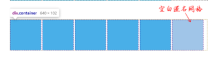
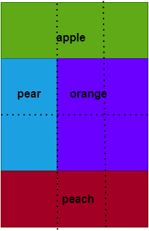

# grid布局

> 给html设置`display:grid`或者`display:inline-grid`,创建网格布局

* inline-grid容器外部盒子保持内联性,因此可以和图片文字在同一行显示
* grid容器保持块状特性,`width`默认是100%,不和内敛元素在一行显示

> 分别作用在grid容器和作用在grid子项上的属性

<table cellspacing="0" border="1" >
<tr><th>作用在grid容器上</th> <th>作用在grid子项上</th></tr>
<tr><td>grid-template-columns</td><td>grid-column-start</td></tr>
<tr><td>grid-template-rows</td><td>grid-column-end</td></tr>
<tr><td>grid-template-areas</td><td>grid-row-start</td></tr>
<tr><td>grid-template</td><td>grid-row-end</td></tr>
<tr><td>grid-column-gap</td><td>grid-column</td></tr>
<tr><td>grid-row-gap</td><td>grid-row</td></tr>
<tr><td>grid-gap</td><td>grid-area</td></tr>
<tr><td>justify-items</td><td>justify-self</td></tr>
<tr><td>align-items</td><td>align-self</td></tr>
<tr><td>place-items</td><td>place-self</td></tr>
<tr><td>justify-content</td><td></td></tr>
<tr><td>align-content</td><td></td></tr>
<tr><td>place-content</td><td></td></tr>
<tr><td>grid-auto-columns</td><td></td></tr>
<tr><td>grid-auto-rows</td><td></td></tr>
<tr><td>grid-auto-flow</td><td></td></tr>
<tr><td>grid</td><td></td></tr>
</table>

* 重要的几个知识点
  1. `grid-template-columns/grid-template-rows`基础语法
  2. `fr`单位
  3. `repeat()`函数的基本语法
  4. `grid`属性缩写
  5. `grid`对齐属性
  6. `grid-area`属性

## grid-template-columns/grid-template-rows

> `grid-template-columns`和`grid-template-rows`属性主要用来指定网格的**数量和尺寸**等

````css
grid-template-columns: 80px auto 100px;
grid-template-rows: 25% 100px auto 60px;
````

* `grid-template-columns`属性的三个值:表示网格分别分为3列.

  * 从左往右:80px,auto,100px

* `grid-template-rows`属性含4个值:表示网格分为了4行

  * 从上到下依次是25%,100px,auto,60px

* 可以发现这两个属性,都是对应行和列的个数

* 并且可以使用简写`grid-template`

  ````css
  grid-template: 25% 100px auto 60px / 80px auto 100px;
  ````

* 或者直接使用`grid`代替`grid-template`

> 网格线的命名:`grid-template-columns`可以给网格线命名

* 语法:`grid-template-columns:<line-name> <track-size> ...`
  * `<track-size>`:表示划分出来的网格尺寸,可以是长度值,百分比值,fr单位(网格剩余空间比例单位)和尺寸关键字等多种类型的属性值
  * `<line-name>`:表示划分的空白(网格之间的空白)名称,命名规则和css动画一样
  * 上述的示意:`grid-template-columns:[空白1] 80px [空白2] auto [空白3] 100px [空白4]`

* 使用`[]`来包裹我们自定义的名称,可以是中文名

* 使用网格需要在语义非常明确的页面才有必要使用

  * 网格线的命名主要用于`grid-column-start`,`grid-column-end`,`grid-row-start`,`grid-row-end`等属性,该功能主要作用在**grid子项上**,方便描述grid子项占据的网格区域

* 并且由于网格的中间的区域的网格线是由两边格子公用的,因此可以给网格线起名子的时候**可以起两个名字**

  ```css
  .container{
      grid-template-columns:[空白1左] 120px [空白1右 空白2左] 600px [空白2右];
  }
  ```

### <track-size>

> `grid-template-columns`属性的默认值是none,可以使用`grid-auto-columns`设置网格尺寸

* `grid-template-columns`属性还支持名为`subgrid`的关键字,(字面意思**次网格**),适用于当前网格既是grid子项同时也是grid容器的场景.并且这种场景元素的尺寸右父网格定义,而不是通过具体的数值指定
* `<track-size>`:支持一下全部属性
  1. 长度值
  2. 百分比值
  3. 关键字属性.包括`min-content`,`max-content`以及`auto`
  4. <flex>数据类型,以`fr`为单位
  5. 函数值,包括:`repeat()`,`minmax()`和`fit-content()`
* `min-content`:网格布局中的同一行grid子项的高度和同一列grid子项的宽度都是一致的
  * 所以min-content指的是一排或者一列格子中所有最小内容尺寸中的最大的那个最小内容尺寸值(不是某一个格子的最小尺寸)

```html
<style>
.container { 
    display: grid; 
    grid-template-columns: min-content auto;
} 
</style>
<div class="container"> 
    <item>css</item> 
    <item></item> 
    <item>css_world</item> 
    <item></item> 
    <item>css_new_world</item> 
    <item></item>
</div>
```

* `max-content`:最终的尺寸是最大内容宽度中最大的那个
* `auto`:**尺寸的上限**是最大内容尺寸的最大值.与`max-content`不同的是,这里的尺寸会受到`justify-content`和`align-content`影响

<iframe height="300" style="width: 100%;" scrolling="no" title="Untitled" src="https://codepen.io/jack-zhang-1314/embed/bGaRaZx?default-tab=html%2Cresult" frameborder="no" loading="lazy" allowtransparency="true" allowfullscreen="true">
  See the Pen <a href="https://codepen.io/jack-zhang-1314/pen/bGaRaZx">
  Untitled</a> by Jack-Zhang-1314 (<a href="https://codepen.io/jack-zhang-1314">@jack-zhang-1314</a>)
  on <a href="https://codepen.io">CodePen</a>.
</iframe>

* 当`justify-content: stretch;`声明下的尺寸是完全大于`max-content`尺寸的(auto上限和max-content的区别)
* 当多列的宽度同时设置auto的时候们这些列不会是等分的,<span style="color:red">而是在max-content的基础上增加同样大小的尺寸</span>
* **尺寸下限**就是最小尺寸的最大值.如果min-width,min-height的属性值比最小内容尺寸大的时候,最小尺寸就是**min-width,min-height**的属性值
* 如果没有`minmax()`函数指定了新的尺寸上下限,否则auto关键字的尺寸表现都在上面说的上限尺寸和下限尺寸之间.等同于`minmax(auto,auto)`

#### 网格布局专用单位fr

* 网格布局通常有多列或者多行.其中有些列是固定的宽度.有些列的宽度是由页面自动分配,而fr就是这些自动分配列的尺寸划分比例

* fr单位的计算规则
  1. 如果所有的fr值之和大于1,则按fr值的比例划分可自动分配尺寸
  2. 如果所有的fr值之和小于1,最终的尺寸是可自动分配尺寸和fr值的乘法计算值(会有剩余空间)

> 所有的列都使用hr

```css
.container{
  grid-template-columns:1fr 1fr 1fr;
}
```

* 按照比例划分:各容器之比都是1:1:1
* 

```css
.container{
  grid-template-columns:0.2fr 0.2fr 0.2fr;
}
```

* fr的总和<1,按照容器尺寸和fr值的计算值的乘积划分(产生40%的空间没有网格元素)
* 

>部分列是固定的长度

* 如果部分列是固定的长度值,那么可以自动分配的吃寸就是容器尺寸减去固定的尺寸

```css
.container{
  grid-template-columns: 200px 1fr 1fr 1fr;
}
```

* 后面的三列去除200px,之后等分宽度

> 与auto关键字混用

* 如果部分列使用的是auto关键字,则fr的值的计算规则就与设置auto这一列的内容密切相关

```css
.container{
  grid-template-columns: auto 1fr 1fr 1fr;
}
```

* 
* fr值可自动分配尺寸:容器减去设置auto关键字的`fit-content`的尺寸.
  * 由于这里设置auto关键字这一列的内容较少,fit-content就是这几个字符的宽度尺寸
  * 所以最后三列的宽度就是总宽度减去`宽auto`这几个字符平分的尺寸

* fr之后小于1

   ```css
   .container{
     grid-template-columns: auto 0.2fr 0.2fr 0.2fr;
   }
   ```
  
  * 
  * fr的值可自动分配的空间是容器尺寸-`宽度auto`得到的尺寸.
  * 后面的3个设置`.25fr`网格的宽度为可自动分配尺寸乘以0.25
  * 剩余的宽度就是第一个网格宽度

#### 函数值

>repeat(),minmax()以及fit-content()这三个网格布局函数

* repeat()函数的性质与`fit-content()`和`minmax()`函数不同的地方在于.`repeat()`不会直接参与尺寸设置,其作用更像是一种简化的代码语法形式.
  * 可以包含`fit-content()`和`minmax()`函数
  * `fit-content()`和`minmax()`作用则是设置弹性尺寸,不可以包含repeat()

>minmax()

* `minmax(min,max)`:表示尺寸范围限制在min~max范围内

```css
minmax( [ <length> | <percentage> | min-content | max-content | auto ] , [ <length> | <percentage> | <flex> | min-content | max-content | auto ] )
```

* <span style="color:red">\<flex>数据类型(如fr单位的值)只能作为第二个参数出现</span>

```css
/* 非法,无效的 */
grid-template-columns: minmax(1fr , 200px) 1fr 1fr
```

* 在使用grid布局的同时.如果使用minmax()函数,则不同宽度设备下的尺寸会更加智能

>fit-content()

* 让尺寸适应于内容,但是不超过设定的尺寸
* 计算公式:`fit-content(limit) = max(minimum,min(limit,max-content))`
  * `minimum`(为方便可以看作min-content)是尺寸下限,如果不考虑`min-width/min-height`属性,这个尺寸就是最小内容尺寸
  * 大概效果就是:尺寸由内容决定,内容越多尺寸越大,但是不超过限定的尺寸
  * 常常用于希望grid子项的宽度随着内容变化,并且宽度不要太大

* 正式语法:`fit-content( [ <length> | <percentage> ] )`
  * 只支持数值和百分比,fr值是不合法的

```css
/* 不合法,无效 */
grid-template-columns:fit-content(1fr);
```

##### repeat():网格尺寸可以重复的时候简化代码

```css
.container{
  grid-template-columns:40px auto 60px 40px auto 60px;
  /* 等价于 */
  grid-template-columns:repeat(2,40px auto 60px);
}
```

* 正式语法:<tracklist>就是不包括repeat()函数在内的所有`grid-template-columns`支持的属性值,包括fr值和`min-content/max-content`,以及minmax()和fit-content()函数

```css
repeat( [ <positive-integer> | auto-fill | auto-fit ] , <tracklist> )
```

* <positive-integer>就是正整数的意思,表示尺寸重复的次数

```css
/* 合法的 */
repeat(4, [col-start] min-content [col-middle] max-content [colend])
repeat(4, [col-start] fit-content(200px) [col-end]) 
repeat(4, 10px [col-start] 30% [col-middle] auto [col-end])
```

* 如果无法确定网格布局的列数,而且希望网格布局的列数随着容器宽度变化,这个时候不能设置重复次数为固定的整数值
  * 使用`auto-fill`或者`auto-fill`

> auto-fill关键字

<iframe height="300" style="width: 100%;" scrolling="no" title="auto-fill" src="https://codepen.io/jack-zhang-1314/embed/gOoRKxB?default-tab=html%2Cresult" frameborder="no" loading="lazy" allowtransparency="true" allowfullscreen="true">
  See the Pen <a href="https://codepen.io/jack-zhang-1314/pen/gOoRKxB">
  auto-fill</a> by Jack-Zhang-1314 (<a href="https://codepen.io/jack-zhang-1314">@jack-zhang-1314</a>)
  on <a href="https://codepen.io">CodePen</a>.
</iframe>

* grid容器可以放下6个100px宽的grid子项,则此时auto-fill关键字值等同于6.
* 不过由于这里的grid子项的元素\<item>只有5个,因此会产生一个空白子项
* 

* 如果grid子项是375px,最多可以放3个100px宽的grid子项,则此时的auto-fill关键字等同于3.
  * 此时的布局效果就是剩下的元素会换行显示
  * 但是这时候右端会显示出一些空白区域影响观感,可以设置`repeat(auto-fill,minmax(100px,1fr))`

* 注意:<span style="color:red">如果使用auto-fill关键字自动填充的时候,repeat()函数不能和auto一起使用</span>
  
   ```css
   /* 不符合,无效 */
   grid-template-columns:repeat(auto-fill,100px) auto;
   ```

> auto-fit

* auto-fit关键字会把空白匿名网格进行折叠合并.而这个合并的0px大小的格子可以被认为具有单个格子轨道大小调整的功能.并且空白匿名格子两侧的过道(`grid-gap`设置空隙)也会合并

```css
.container { 
  grid-template-columns: repeat(auto-fill, 100px);
} 
.container { 
  grid-template-columns: repeat(auto-fit, 100px);
}
```

* 
* auto-fit如果配合fr一起使用,可以保证无论grid容器宽度多大,<span style="color:red">grid子项都可以填满容器</span>.`repeat(auto-fit, minmax(100px, 1fr))`
  * 如果在同样的情况下使用`auto-fill`关键字,则出现一片空白区域

<iframe height="300" style="width: 100%;" scrolling="no" title="auto-fill/auto-fit" src="https://codepen.io/jack-zhang-1314/embed/qBpjyaM?default-tab=html%2Cresult" frameborder="no" loading="lazy" allowtransparency="true" allowfullscreen="true">
  See the Pen <a href="https://codepen.io/jack-zhang-1314/pen/qBpjyaM">
  auto-fill/auto-fit</a> by Jack-Zhang-1314 (<a href="https://codepen.io/jack-zhang-1314">@jack-zhang-1314</a>)
  on <a href="https://codepen.io">CodePen</a>.
</iframe>

* <span style="color:red">repeat()函数只能用在grid-template-colums和grid-template-rows这两个属性</span>

## grid-template-areas

>grid-template-area属性用来指定网格区域的划分,注意是areas

```css
container { 
    grid-template-areas: "<grid-area-name> | . | none | ..." "...";
}
```

* <grid-area-name>表示对应网格区域的名称,命名规则和anImation-name属性一样

* `.`表示空的网格单元格

  ```css
  grid-template-areas: 
    "a a ."
    ". b c";
  ```

  * 表示第一行第三列和第二行第一列的网格是一个空的单元格

* `none`表示没有定义单元格



* 对应的css代码

```css
.container { 
    grid-template-columns: 1fr 1fr 1fr; 
    grid-template-rows: 1fr 1fr 1fr 1fr;
    grid-template-areas: 
        "apple apple apple" 
        "pear orange orange" 
        "pear orange orange" 
        "peach peach peach";
}
```

* grid子项需要四个元素

```html
<div class="container"> 
    <item class="apple"></item> 
    <item class="pear"></item> 
    <item class="orange"></item> 
    <item class="peach"></item>
</div>
```

* 指定子项的`grid-area`属性属于哪一个区域

```css
.apple{ grid-area:"apple"}
.pear{ grid-area:"pear"}
.orange{ grid-area:"orange"}
.peach{ grid-area:"peach"}
```

1. 如果我们给网格区域命名了,但是没有给**网格线命名**.则系统会自动命名,在区域名称后面加`-start`和`-end`
   * 例如网格区域名称`apple`:左侧网格线就是`apple-start`,右侧网格线就是`apple-end`
   * 实际上,设置在grid子项上的`grid-row-start`,`grid-row-end`,`grid-column-start`和`grid-column-end`属性也是可以使用`grid-template-areas`的区域命名的(因为网格线会自动生成)
2. 网格区域一定要形成规整的矩形区域,无论是L形,还是凹的或凸的形状都会认为是无效的属性值
