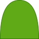

## 自适应椭圆

>利用`border-radius`很容易得到圆角的属性

* 利用圆角属性很容易画出[圆和椭圆](01.自适应椭圆.html)

```css
.circular {
  height: 300px;
  width: 300px;
  background-color: violet;
  border-radius: 50%;
}
.oval {
  height: 200px;
  width: 300px;
  background-color: violet;
  border-radius: 50%;
}
```

> [半椭圆](02半椭圆.html)

1. `border-radius`:是以下属性的简写.他的值会以左上角以顺时针顺序应用到各个拐角
   1. `boreder-top-left-radius`
   2. `boreder-top-right-radius`
   3. `boreder-bottom-right-radius`
   4. `boreder-bottom-left-radius`
2. 可以为四个角提供完全不同的水平和垂直半径
   * 斜杠前(/)指定`1~4`个值,(/)后指定`1~4`个值
   * 例如`border-radius:10px/5px 20px`,相当于`10px 10px 10px 10px/5px 20px 5px 20px`



1. 这个形状垂直对称.<span style="color:red">左上角和右上角的半径相同,左下角和右下角的半径相同</span>
2. 水平方向上:左上角和右上角整个顶部都是曲线,可以看出左右两个角平分整个形状的宽度(使用50%)
3. 垂直方向上:左下角和右下角没有任何圆角(0).并且左上角和右上角占据了整个元素的高度(100%)

```css
.halfElliptical {
  width: 100px;
  height: 200px;
  background-color: violet;
  border-radius: 50% 50% 0 0/100% 100% 0 0;
}
```

* 水平方向的半椭圆也很容易了

```css
border-radius: 100% 0 0 100%/50% 0 0 50%;
```

> 四分之一的椭圆也就唾手可得

```css
border-radius:100% 0 0 0;
```

## [平行四边形](03平行四边形.html)

>**skew()**:两种简写形式:`skewX()`,`skewY()`

1. `skewX()`:表示在X轴方向的倾斜程度.单位deg.如果是正数则表示元素沿X轴逆时针倾斜;如果是负数,则表示元素眼x轴顺时针倾斜
2. `skewY()`:表示在Y轴方向的倾斜程度.单位deg.如果是正数则表示元素沿y轴顺时针倾斜;如果是负数,则表示元素眼x轴逆时针倾斜

### 伪元素

>当我们使用`skew()`的时候,整个平行四边形都发生变形,其中内容也会发生变形.

* 将所有的样式(背景,边框等)应用到伪元素,然后对伪元素进行变形
* 设置宿主的`position:relative`样式,并设置伪元素`position:absolute`,然后把所有偏移量都设置为0

```css
.parallelogram {
  width: 200px;
  height: 100px;
  position: relative;
  font-size: 5rem;
}
.parallelogram::before {
  position: absolute;
  right: 0%;
  left: 0%;
  bottom: 0%;
  top: 0%;
  content: '';
  background-color: violet;
  transform: skew(20deg, 0);
  z-index: -1;
}
```

## [菱形图片](04菱形.html)

>`rotate()`,元素按中心顺时针旋转.单位`deg`

1. 图片不能根据父元素旋转,需要保持不变.所以不能使用伪元素,伪元素会紧跟着父元素变化
2. 只能子元素旋转父元素旋转的负角度

```css
.picture {
  width: 25rem;
  height: 25rem;
  transform: rotate(45deg);
  overflow: hidden;
}
.picture>img {
  width: 100%;
  height: 100%;
  transform: rotate(-45deg);
}
```

>* 问题是图片被原来的旋转后的大小切割,这里要使用`scale()`来放大图片,使菱形更合理
>* 放大的图片应该约等于原来图片的1.42倍,旋转45°,增大根号2倍

```css
transform: rotate(-45deg) scale(1.42);
```

### [裁切路径](04菱形(polygon).html)

>使用`clip-path`属性:允许把元素裁剪为任何想要的形状.使用`polygon()`函数来指定一个菱形

* **polygon()**:它的参数是一组坐标对，每一个坐标对代表多边形的一个顶点坐标(坐标对的第一个是x轴,第二个是y后)。浏览器会将最后一个顶点和第一个顶点连接得到一个封闭的多边形。坐标对使用逗号来进行分隔，可以使用绝对单位或百分比单位值
* 坐标的原点是以图片的左上角开始的

```css
img {
  height: 25rem;
  width: 25rem;
  clip-path: polygon(50% 0, 100% 50%, 50% 100%, 0 50%);
}
```

