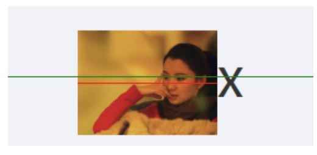
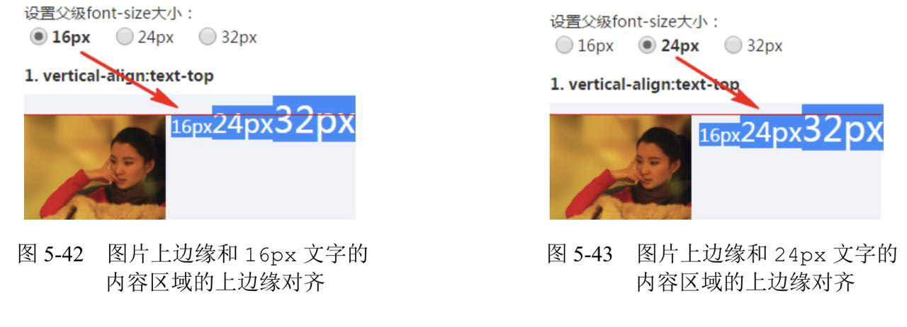

## css基础

| 布局方式   | 描述                                                                                                                                                      | 特点                                                                   | 场景                                                |
| ---------- | --------------------------------------------------------------------------------------------------------------------------------------------------------- | ---------------------------------------------------------------------- | --------------------------------------------------- |
| 静态布局   | Static Layout,传统Web设计,网页上的所有元素的尺寸一律使用px作为单位.不管浏览器尺寸具体是多少,网页布局始终按照最初写代码时的布局来显示.一般需要设置最小宽度 | 不能根据用户的屏幕尺寸做出不同的表现                                   | 传统PC网页                                          |
| 流式布局   | Liquid Layout,页面元素的宽度按照屏幕分辨率进行适配调整,但整体布局不变.代表作栅栏系统（网格系统）                                                          | 网页中主要的划分区域的尺寸使用百分数（搭配min-、max-属性使用）         | 屏幕分辨率变化时,页面里元素的大小会变化而但布局不变 |
| 自适应布局 | Adaptive Layout,使用@media分别为不同的屏幕分辨率定义布局,即创建多个静态布局,每个静态布局对应一个屏幕分辨率范围                                            | 屏幕分辨率变化时,页面里面元素的位置会变化而大小不会变化                | -                                                   |
| 响应式布局 | Responsive Layout,一个页面在所有终端上（各种尺寸的PC、手机、手表、冰箱的Web浏览器等等）都能显示出令人满意的效果                                           | 每个屏幕分辨率下面会有一个布局样式,即元素位置和大小都会变              | 多终端页面                                          |
| 弹性布局   | rem/em布局,包裹文字的各元素的尺寸采用em/rem做单位,而页面的主要划分区域的尺寸仍使用百分数或px做单位                                                        | 理想状态是所有屏幕的高宽比和最初的设计高宽比一样,或者相差不多,完美适应 | 移动端                                              |

* **流体布局**,指的是利用元素"流"的特性实现的各类布局效果.因为"流"本身 具有自适应特性,所以"流体布局"往往都是具有自适应性的. 但是,"流体布局"并不等同于 "自适应布局".
* **自适应布局**是对凡是具有自适应特性的一类布局的统称,"流体布局"要狭窄得多.例如,表格布局也可以设置为100%自适应,但表格和"流"不是一路的,并不属于"流体布局". 通俗的说,流体布局就是在width:auto;或者格式化宽/高中,通过设定`margin/border/padding`来影响content的布局的方式

### css的引入样式

1. 内部样式表:将代码写在`<style></style>`中
2. 行内样式表:`<div style="color:red">你好</style>`
3. 外部样式表:`<link ref="stylesheet(样式表)" href="路径">`

### width:auto

1. **充分利用空间**,块级元素的默认宽度使父级元素宽度的100%
2. **收缩与包裹**,当元素处于浮动,绝对定位或者为内敛快元素或table元素,父级元素失去原有的宽度收缩到与内部元素一样
3. **收缩到最小**,这个容易出现在table-layout为auto的表格中,为了超过父级元素的宽度
4. **超出容器限制**,除非右明确的width相关设置,否则上面三种情况都不会超过父级的容器宽度(如果设置很长的英文,或者`white-space:nowrap`)

#### 外部尺寸与流体特性

1. 正常流宽度默认是`100%`
   * 在页面中随便扔一个div元素,其尺寸表现就会和水流一样铺满容器.这就 是block 容器的流特性.
   * 所谓流动性是一种根据`margin/border/padding/content`属性对其内容区域自动分配水平空间的机制
   
<iframe height="300" style="width: 100%;" scrolling="no" title="Untitled" src="https://codepen.io/jack-zhang-1314/embed/WNXmWdJ?default-tab=html%2Cresult" frameborder="no" loading="lazy" allowtransparency="true" allowfullscreen="true">
  See the Pen <a href="https://codepen.io/jack-zhang-1314/pen/WNXmWdJ">
  Untitled</a> by Jack-Zhang-1314 (<a href="https://codepen.io/jack-zhang-1314">@jack-zhang-1314</a>)
  on <a href="https://codepen.io">CodePen</a>.
</iframe>

2. 格式化宽度
   * 格式化宽度仅出现在"绝对定位模型"中,也就是出现在position属性值为absolute和fixed的元素中,在预设情况下绝对定位元素的宽度表现是"包裹性","宽度由内部尺寸决定",但是有一中情况下由外部尺寸决定.
   * 在 CSS 中,可替换元素（replaced element）的展现效果不是由 CSS 来控制的.这些元素是一种外部对象,它们外观的渲染,是独立于 CSS 的. 典型的可替换元素有：\<iframe>\<video>\<embed>\
   * 对于非替换元素,当 left/right 或 top/bottom 对立方位的属性值同时存在的时候,元素的宽度表现为"格式化宽度",其宽度大小相对于最近的具有定位特性 (position属性值不是static) 的祖先元素计算

   ```html
   <style>
   .father {
      position: relative;
      width: 300px;
      height: 150px;
      border: 1px solid saddlebrown;
    }
    .father > .son {
      position: absolute;
      top: 0px;
      right: 0px;
      bottom: 0px;
      left: 0px;
      margin: auto;
      width: 100px;
      height: 50px;
      border: 1px solid salmon;
    }
   </style>
   <div class="father">
     <div class="son"></div>
   </div>
   ```

#### 内部尺寸与流体特性

>所谓"内部尺寸",简单来讲就是元素的尺寸由内部的元素决定,而非由外部的容器决定.

1. 包裹性
   * 包裹性"除了"包裹",还有"自适应性".所谓"自适应性"指的是元素尺寸由内部元素决定,但永远小于"包含块"容器的尺寸(除非容器尺寸小于元素的"首选最小宽度").
   * 按钮就是css世界中极具代表性的`inline-block`元素,可谓展示"包裹性"最好的例子,具体表现为:按钮文字越多宽度越宽(内部尺寸特性),但如果文字足够多,则会在容器的宽度处自动换行(自适应性)

2. 首选最小宽度
   * 图片和文字的权重要远大于布局,当布局中存在更高权重元素时(如`width:0`不生效)最小宽度受其内容影响 (文字中的最小宽度为单个字符宽度)
   * `word-break: break-all` break-all 对于non-CJK (CJK 指中文/日文/韩文) 文本,可在任意字符间断行.

3. 最大宽度
   * `white-space` CSS 属性是用来设置如何处理元素中的空白.
   * 最大宽度就是元素可以有的最大宽度."最大宽度"实际等同于"包裹性"元素设置`white-space: nowrap` 声明后的宽度.(连续的空白符会被合并.但文本内的换行无效) 如果内部没有块级元素或者块级元素没有设定宽度值,则"最大宽度"实际上是最大的连续内联盒子的宽度

#### css流体布局下的宽度分离原则

>所谓"宽度分离原则"就是css中的width属性不与影响宽度的padding/border（有时候包括margin）属性共存, 通过设置 padding,margin,border,内部内容通过 width：auto 自动填充

#### min-width/max-width和min-height/max-height

>为流体而生的min-width/max-width

* 比如,网页宽度在1200～1400像素自适应,既满足大屏的大气又满足笔记本的良好显示,此时,`min-width/max-width`就可以大显神威了

```css
.container {
  min-width: 1200px;
  max-width: 1400px;
}
```

* 公众号的热门文章中,经常会有图片,这些图片都是用户上传产生的,因此尺寸会有大有小,为了避免图片在移动端展示过大的影响体验,常常会有下面的`max-width`(百分比是相对于父容器的)限制

```css
img {
    max-width: 100%;
    height: auto!important;
}
```

* 原始图片有设定height,max-widht生效的时候图片就会被水平压缩.强制height为auto可以确保宽度不超出的同时使图片保持原来的比例. 但这样也会有体验上的问题,那就是在加载时图片占据高度会从0变成计算高度,图文会有明显的瀑布式下落

> 不同的初始值:`min-weidht/min-height` 的初始值是auto,`max-width/max-height` 的初始值是 none

* 超越!important,超越最大.超越!important 指的是 max-width 会覆盖 width
* 比方说,针对下面的 HTML 和 CSS 设置,图片最后呈现的宽度是多少？

```html

<style>
img {
    max-width: 256px;
}
</style>
```

* 答案是256px.style、!important通通靠边站！因为max-width会覆盖width

* 超越最大指的是`min-width`的值大于`max-width`值时取`min-width`的值超越最大值得是min-width覆盖max-width,此规则发生在min-width和max-width冲突时

```css
.container {
  min-width: 1400px;
  max-width: 1200px;
}
```

* 最小宽度比最大宽度设置得还要大,遵循"超越最大"规则(注意不是"后台者居上"规则) 值取`min-width,max-width`被忽略,于是,.container元素表现为至少1400像素宽

> 优先写问题

* `max-height/width` < `height/width` => `max-height/width` 重载 `height/width`

* `min-height/width` > `height/width` => `min-height/width` 重载 `height/width`

* `min-height/width` > `max-height/width` => `min-height/width` 重载 `max-height/width`

#### width:fit-content

> `fit-content`的样式表现形式就是css2.1的`shrink-to-fit`(包裹性).这种表现和元素应用于`display:inline-block`,`position:absolut`等css声明类似,尺寸收缩但不会包含块级元素的尺寸限制

1. `fit-content`会让元素的尺寸有确定的值(关键)
2. `min-width`属性和`max-width`会正确渲染`fit-content`关键字.但是`max-height`和`min-height`属性设置`fit-content`关键字虽然语法正确,但是不会有任何表现形式

>width: stretch | available | fill-available.关键字

* `stretch`:弹性拉伸,用于替换之前的 available, fill-available
  * 一般`block`,`弹性布局`或者`网格布局`自动会默认自带这种弹性拉伸
* `available`:可用空间.Firefox使用的关键字
* `fill-available`:填充可用空间.webkit浏览器使用的关键字

>`max-content`关键字表示最大内容宽度,作用是让元素尽可能的大

1. 各项宽度不确定,整体宽度自适应
2. 当前项的内容较少
3. 当前项的宽度需要尽可能的小

* 表格布局,弹性布局和网格布局都可以满足以上效果,这些布局自带与内容相关的尺寸规则.<span style="color:red">给子项设置`width:max-content`是没有任何效果的</span>
* 当然`max-content`和`min-content`一样有兼容问题

### height:auto

>关于`height:100%`无效

* height和width还有一个比较明显的区别就是对百分比单位的支持.对于width属性,就算父元素width为auto,其百分比也是支持的；但是,对于height属性,如果父元素height为auto,只要子元素在文档流中,其百分比值完全就被忽略了.

```css
div {
  width: 100%; /* 这是多余的 */
  height: 100%; /* 这是无效的 */
  background: url(bg.jpg);
}
```

>要明白其中的原因要先了解浏览器渲染的基本原理. 首先,先下载文档内容,加载头部样式资源(如果有的话),然后按照从上而下、自外而内的顺序渲染DOM内容. 套用本例就是,先渲染父级元素,后渲染子元素,是有先后顺序的.因此,当渲染到父元素的时候,子元素的width:100%并没有渲染,宽度就是图片加文字内容的宽度;等渲染到文字这个元素的时候,父元素的宽度已经固定,此时的width:100%就是已经固定好的父元素的宽度. 宽度不够怎么办？溢出就好了,overflow属性就是为此而生的

* 由于没有显示定义height,就将height解释成字符串`auto`=>`'auto' * 100/100 = NaN`

>设置显示的高度(或者也可以使用绝对定位)

```css
html, body {
    height: 100%;
}
```

#### 任意高度元素的展开收起动画技术

>第一反应就是使用`height + overflow:hidden`实现,但是,很多时候我们展开的元素内容是动态的,换句话说高度不是固定的,因此,height使用的值是默认的auto,应该都知道的auto是个关键字值,并非数值,正如height: 100%的100%无法和auto相计算一样,从0px到auto是无法计算的,因此无法形成过渡或动画效果

```css
/* 因此,下面代码呈现的效果也是生硬的展开和收起 */
.element {
    height: 0;
    overflow: hidden;
    transition: height .25s;
}

.element.active {
    height: auto; /* 没有transition效果,只是生硬的展开 */
}

/* 难道就没有什么一劳永逸的实现方法吗？有,不妨试试max-height */
.element {
    max-height: 0;
    overflow: hidden;
    transition: max-height .25s;
}

.element.active {
    max-height: 666px /* 一个足够大的高度值 */
}
```

>其中展开后的max-height值,我们只需要设定为保证比展开内容高度大的值就可以,因为max-height值比height计算值大的时候,元素的高度就是height属性的计算高度, 在本交互中,也就是height: auto时候的高度值。于是,一个高度不定的任意元素的展开动画就实现了

* 但是,使用此方法也有一点要注意,既虽然从适用范围讲,max-height值越大使用场景越多,但是,如果max-height值太大,在收起的时候可能会有“效果延迟”的问题。比方说,展开的元素高度是100px,而max-height是1000px,动画时间是250ms,假设动画函数是线性的,则前255ms我们是看不到收起效果的,因为max-height从1000像素到100像素变化这段时间,元素不会有区域被隐藏,会给人动画延迟225ms的感觉

* 因此,建议max-height使用足够安全的最小值,这样,收起时即使有延迟效果,也会因为时间很短,很难给用户察觉,并不会影响体验

### Emment语法

1. 生成多个相同标签,用*,例如:div*3
2. 父子级关系标签,用>,例如,ul>li
3. 兄弟级关系的标签,用+,例如div+p  
4. 生成带有类名的或者id名的,直接写.demo或者#two, tab键
5. 如果生成div类名是有顺序的,可以用自增符号,例:```.demo$*5```
6. 如果在生成的标签内部些内容,可以用{}表示,```div{你好}```,tab键

## 盒子模型

### 内容(content)

#### 替换元素

>替换元素:通过修改某个属性值呈现的内容就可以被替换的元素就称为替换元素(例如\,\<input>登都是典型的替换元素)

1. 内容外观不受页面上的css的影响.即样式表现在css之外
2. 有自己的尺寸.默认的尺寸(不包括边框)是300px*150px,像\<video>等.也有如\这样替换元素为0px的.
3. 在css属性上有一套自己的表现规则

* \<select>:首先内容可以替换,如果设置multiple属性,下拉就变成了展开直选多选的模式.并且样式外部的css很难更改.最后他也有自己的尺寸

> 替换元素的默认display

* 一般替换元素是内联元素(`inline`)或者是行内块元素(`inline-block`)

> 替换元素的尺寸

1. 固有尺寸:替换内容原本的尺寸
2. HTML尺寸,这些HTML原生的尺寸.例如\的width,height,\<input>的size,\<textarea>的cols和rows
3. CSS尺寸,通过css属性的width和height或者max-width/min-width和max-height/min-height设置尺寸

* 注意
  * 如果固有尺寸含有固有的宽高比例,同时设置了宽度和高度,则元素依然按照固有的宽高比例
  * \中如果图片缺省,不需要使用`src=""`,只要有`src=""`就会产生请求

>`object-fit`:替换内容的适配方式

1. 默认是`fill`,也就是外部设定的尺寸多大,我就填满,跟着一样大
2. `none`:图片的尺寸完全不受控制.会保持图片原来的大小.如果设置了大小,超过范围不会显示
3. `contain`:保持图片比例,尽可能利用html的尺寸但是不会超出的显示方式

* 同时在伪元素中可以使用`content:attr()`获取html标签中的属性例如`attr(alt)`.url等也可以使用

>content元素与替换元素

* `content`属性生成的对象被称为匿名替换元素

1. 使用content生成的文本是无法选中的,也是无法复制的.同时content生成的文本无法被屏幕设备阅读,搜索引擎抓取
2. 不能左右`:empty`(当元素中没有内容时进行匹配)伪类
3. 动态生成的值无法获取(自动累加,计数器)

#### content内容生成

> content设置成空字符串,然后利用其他的css代码生成辅助元素,或实现图形,或实现特定布局.

1. content中图片生成,直接使用`content:url()`不易控制图片.

   ```css
   div::before{
     content:'';
     background:url();
   }
   ```

2. attr属性值生成内容.除了原生的html属性.也可以使用自定义的html属性

> content计数器.两个属性`counter-reset`和`counter-increment`.两个方法`counter()`和`increment()`

1. **counter-reset**:计数器-重置,默认是从0开始,可以使用负数或者小数(各个浏览器不同)
   * 同时可以多个计数器同时命名
2. **counter-increment**:计数器递增.值为`counter-reset`的一个或者多个关键字,后面可以跟数字,表示每次计数的变化值

    ```html
    <style>
      .counter {
        counter-reset: cun 2;
        counter-increment: cun 1;
      }
      .counter:before {
        content: counter(cun);
      }
    </style>
    <body>
      <p class="counter"></p>
      <p class="counter"></p>
    </body>
    ```

3. `counter()/counters()`:显示计数
   * `counter(name,style)`,其中style支持的参数就是`list-style-type`支持的参数
   * `counters(name,string,style)`string参数是字符串,表示子序号的连接字符串
     * 使用这个方法可以实现序列的嵌套.通过子辈对父辈的`counter-reset`重置,配合counters()方法

```html
<style>
  .reset {
    counter-reset: cun 0;
  }
  .counter:before {
    counter-increment: cun 1;
    content: counters(cun, ".");
  }
</style>

<body>
  <div class="reset">
    <div class="counter">
    </div>
    <div class="reset">
      <div class="counter">大儿子</div>
      <div class="counter">二儿子</div>
      <div class="counter">三儿子</div>
    </div>
    <div class="counter">王小三</div>
    <div class="reset">
      <div class="counter">大儿子</div>
      <div class="counter">二儿子</div>
      <div class="counter">三儿子</div>
    </div>
  </div>
</body>
```

* 由于一个容器的普照元素`reset`应该是固定的,一但子元素出现,其实就已经进入下一级嵌套

### 边框(border)

* 简写:```border:border-width || border-style || border-color;```,没有顺序
* 分开写法:border-right/border-left/border-top/border-bottom  

| 属性         | 作用                                         |
| ------------ | -------------------------------------------- |
| border-width | 边框粗细,px                                  |
| border-style | 边框样式 实线:solid/ 虚线:dashed/ 点线dotted |
| border-color | 边框颜色                                     |

* 合并相邻边框```border-collapse:collapse;```

* <span style="color:red">注意:</span>
  1. 测量盒子大小的时候,不量边框
  2. 如果测量的时候包含了边框,则需要width/height减去边框宽度

### 内边距(padding)

> 在使用padding时尽量不要使用`box-sizing:border-box`.局部使用尽量使用无宽度以及宽度分离准则

* 内联元素的padding依然会对垂直方向的元素有影响.不过内联元素没有可视化的宽高(clientHight和clientWidth永远是0)
  * 垂直方向的行为完全受`line-height`和`vertical-align`的影响
  * 不过视觉上并不会改变上一行和下一行内容的间距(需要加上一些效果,例如`background-color`)

>css中出现这种层叠的现象

1. 一类是纯视觉层叠,不影响外部尺寸.(例如relative元素的定位,box-shadow,以及outline等)
2. 另一种会影响外部尺寸.例如`padding`

* 区分:给父级设置`overflow:auto`,如果层叠区域超出父容器,没有出现滚动条,则是纯视觉的;如果出现滚动条,则会影响尺寸,影响布局

1. padding属性用于设置内边距,即边框与内容之间的距离

| 属性           | 作用     |
| -------------- | -------- |
| padding-left   | 左内边距 |
| padding-right  | 右内边距 |
| padding-top    | 上内边距 |
| padding-bottom | 下内边距 |

| 值的个数                    | 表达意思                                  |
| --------------------------- | ----------------------------------------- |
| padding:5px;                | 1个值代表上下左右都有5px                  |
| padding:5px 10px;           | 2个值代表上下内边距5px,左右内边距10px     |
| padding:5px 10px 20px;      | 3个值,代表上内边距5px,左右10px,下20px     |
| padding:5px 10px 20px 30px; | 4个值,上是5px,右10px,下20px,左30px,顺时针 |

* <span style="color:red">注意:</span>
  1. 内容和边框有了距离,添加内边框
  2. padding影响盒子实际大小
  3. 如果盒子有了高度和宽度,此时指定内边框,会撑大盒子
     * 解决方案: 让width/height减去多出来的内边距大小
  4. 如果盒子本身没有指定width/height属性,则此时paddiong不会撑开盒子大小

> padding的百分比值:<span style="color:red">无论是水平方向还是垂直方向均是相对于宽度计算的</span>

* 很多表单元素都会内置`padding`
  * 内置padding的元素:\<input>,\<textarea>,\<button>,\<select>
  * 单选框不内置,\<radio>,\<checkbox>

>使用padding回值双层圆点

```css
.box {
  display: inline-block;
  width: 100px;
  height: 100px;
  padding: 10px;
  border: 10px solid;
  border-radius: 50%;
  background-color: black;
  background-clip: content-box;
}
```

### 外边距(margin)

>margin对尺寸没有影响,只是元素是<span style="color:green">充分利用可用空间</span>状态的时候.margin才可以改变元素的可视尺寸

* 对于普通的块状元素,在默认的水平流下,margin之恶能改变左右的内部尺寸,垂直方向无法改变(这是由`margin:auto`的计算规则决定的)
  
> margin的百分比值也是相对于宽度计算的

1. 不过由于margin无法在垂直方向上改变元素自身的内部尺寸,往往需要父元素作为载体
2. 并且由于margin合并的问题,垂直方向往往需要双倍尺寸 

>margin属性

* margin属性用于设置外边距,用于控制盒子与盒子之间的距离

   | 属性          | 作用     |
   | ------------- | -------- |
   | margin-left   | 左外边距 |
   | margin-right  | 右外边距 |
   | margin-top    | 上外边距 |
   | margin-bottom | 下外边距 |

> margin合并

* 块级元素的上外边距`margin-top`和下外边距`margin-bottom`有时会合并采购和各位单个外边距

1. 块级元素:但不包括浮动和绝对定位
2. 只发生在垂直方向(不考虑`writing-mode`)

* margin合并的场景
  1. 相邻兄弟元素margin合并
  2. 父级和第一个/最后一个子元素(嵌套块元素垂直外边距的塌陷)
     * 对于来攻嵌套关系(父子关系)的块元素,父元素有上外边距同时子元素也有上外边据,此时父元素会塌陷较大的外边距值
     * 解决方案:
      1. 可以为父元素定义上边框
      2. 可以为父元素定义上内边框
      3. 设置格式化上下文,例如父元素添加```overflow:hidden```(不会增加盒子的大小)

* margin合并的计算规则
  1. 正正取大值
  2. 正负值相加
  3. 负负值最负值

* margin负值的意义在于:在页面中任何地方嵌套或者直接放入任何裸\<div>,都不会影响原来的块状布局

#### margin:auto

>有时候元素没有设置width或者height也会自动填充

```html
<!-- 自动填充 -->
<div></div>

<!-- 自动填充对应的方位 -->
<style>
  div{
    position:absolute;
    left:0;right:0;
  }
</style>
```

>margin:auto填充规则

1. 如果一侧是定值,一侧是auto,则auto为剩余空间大小
2. 如果两侧均是auto,则平分剩余空间大小

* 那就很容易实现右对齐,只要margin-right为0或者不设置

```css
.son{
  width:200px;
  margin-left:auto;
}
```

* 水平居中`margin:0 auto`,会让div布局水平居中在浏览器中
* `margin:auto`不能垂直居中.由于这个属性有一个前提条件,当width或者height为auto时,元素是<span style="color:red">具有对应方向的自动填充特性的</span>.根据html文档流是水平方向自适应的,所以设置垂直方向没用

>设置水平垂直居中(不适用`writing-mode`)

```css
.father{
  width:300px;height:200px;
  position:relative;
}
.son{
  position:absolute;
  top:0;right:0;bottom:0;left:0;
  width:150px;height:100px
}
```

## 内联元素与流

* `line-height`行高的定义就是两基线的间距,`vertical-align`的默认值就是基线

> 字母x与css中的x-height


* `x-height`:就是指小写字母`x`的高度,术语描述就是基线和等分线之间的距离
  * `ascender height`:上下线高度
  * `cap height`:大写字母高度
  * `median`:中线
  * `descender height`:下行线的高度
* 不过`vertical-align:middle`这里的等分线和上面`median`(中线)不是一个意思.这里的middle是指x交叉点的那个位置

>`line-height`:对于纯内联元素,`line-height`就是高度计算的基石

* 例如`line-height`设为16px,则一行文字高度就是16px,两行就是32px

> 内联元素`垂直居中(line-height)`

* 直接设置`line-height`的大小就可以使内联元素近似垂直居中,而不需要设置`line-height=height`
* 多行文本或者替换元素的垂直居中实现原理和单行文本就不一样,需要设置`vertical-align`属性

```html
<style>
  .box{
    line-height: 120px;
    background-color:red;
  }
  .content{
    display:inline-block;
    line-height:20px;
    margin:0 20px;
    vertical-align:middle;
  }
</style>
<div class="box">
  <div class="content">基于高实现的....</div>
</div>
```

1. 多行文本使用一个标签包裹,然后设置display为`inline-block`
   * 在设置`line-height:120px`相当于在`.content`元素前撑起了一个高度为120px,宽度为0的空白节点
2. 因为内联元素默认使基线对齐的,所以当使用`.content`元素设置`vertical-align:middle;`来调整多行文本的垂直位置,从而实现.

### line-height

>不同字体的`line-height:normal;`也不同

1. 数值,例如`line-height:1.5;`,其最终的计算值是和当前`font-size`相乘后的值
2. 百分比值,如`line-height:150%;`,其最终的计算值是和当前`font-size`相乘后的值
3. 长度值,带单位的值,例如`line-height:21px;`或者`line-height:1.5em`
   * 不过由于em是相对于`font-size`的单位.假设`font-size:14px`.那么`line-height=21px;`

* 注意:如果使用数值作为`line-height`的属性值,那么子元素则是继承`line-height`这个属性的数值.例如1.5,会和子元素的`font-size`展开计算得到行高;但是百分比值或者长度则是提前在父元素中利用`font-size`计算得出子元素的行高,然后子元素继承
* 一般使用数值会有更好的排版效果

> `line-height`对于单行纯文本元素配合height可以实现居中,但是遇到替换元素或者多行纯文本元素就不行

* 替换元素的高度不受line-height影响,并且`vertical-align`属性会影响到替换元素

>内联元素的大值特性

```html
<div class="parent">
  <span class="child">绿色</span>
</div>
```

```css
.parent {
  line-height: 20px;
}
.child {
  line-height: 96px;
}
/* 或者这样设置 */
.parent {
  line-height: 96px;
}
.son {
  line-height: 20px;
}
```

* 其实无论内联元素的`line-height`如何设置,最终的父级元素都是由数值最大的那个`line-height`决定的.
* 这里的\<span>是一个内联元素,因此自身是一个**内联盒子**,本例就这一个内联盒子,只要有一个**内联盒子**,就一定会有**行宽盒子**,就是每一行内联元素外面包裹一层看不见的盒子
  * 并且这个**行宽盒子**前面有一个宽度为0的具有该元素的字体和行高属性都看不见的**幽灵空白节点**
  * 实际上

  ```html
  <div class="parent">
    字符<span class="child">绿色</span>
  </div>
  ```

* 当`.parent`设置`line-height:96px`很容易理解.如果`.son`的line-height设置`96px`,<span style="background:red">行宽盒子的高度是由高度最高的**内联盒子**决定的</span>,所以`.parent`的高度永远是最大的那个`line-height`

### vertical-align

>vertical-align起作用的前提条件就是,只能应用于内联元素(inline,inline-block,inline-table)以及table值为table-ceil

* 因此在默认情况下.可以使用于\,\<button>,\<input>等替换元素,或者\<span>,\<strong>,\<em>等内联元素

```html
<style>
  .box{
    height:128px;
    /* 关键css属性, */
    line-height:128px;
  }
  .box>img{
    height:96px;
    vertical-align:middle;
  }
</style>
<div class="box">
  
</div>
```

* 这种情况下`line-height`使`幽灵空白节点`的高度足够.才会使`vertical-align:middle`起作用

1. 线类:`vertical-align:baseline(默认值) | top | middle | bottom;`

   | 值       | 描述                                     |
   | -------- | ---------------------------------------- |
   | baseline | 默认.元素放在父元素的基线上              |
   | top      | 把元素的上边缘或行中最高元素的上边缘对齐 |
   | middle   | 把此元素放置在父元素的中部               |
   | bottom   | 把元素的下边缘与行中最低元素的下边缘对齐 |

2. 文本类:`vertical-align:text-top | text-bottom`
3. 上标下标:`vertical-align:sub | super`
   * `super`:提高盒子的基线到父级合适的下标基线位置.对标\<sup>标签
   * `sub`:降低盒子的基线到父级合适的下标基线位置.对标\<sub>标签
4. 数值百分比:`vertical-align:20px | 2em |20%`
   * 如果vertical-align的计算值是正值,往下偏移,如果是正值,往上偏移.
   * 并且数值的大小相对于基线位置.例如`vertical-align:0`-->`vertical-align:basline`

* `vertical-align`的百分比是相对于`line-height`计算的

* <span style="color:red">当设置浮动或者绝对定位之后,该元素会被块状化,这时候再使用`vertical-align`不起作用</span>

> 内联元素由于幽灵空白节点,line-height,vertical-align会产生很多bug(例如图片在块状盒子中会有间隙)

1. 图片块状化
2. 容器`line-height`足够小.只要半行间距小到,小到没有行间距.例如`line-height=0`
3. 容器`font-size`足够小.不过此方法想要生效,需要容器的`line-height`和`font-size`相关,例如数值或者百分比,否则只会让间隙更大
4. 图片设置`vertical-align`属性,间隙产生的原因就是基线对齐问题,vertical-align设置为top,bottom等值

#### 深入理解vertical-align线类属性值

>* 文本制类的内联元素,`vertical-align`的`baseline`属性值就是字符x的下边缘.对于替换元素则是替换元素的下边缘
>* 如果是`inline-block`,则规则要复杂,如果里面没有内联元素,或者overflow不是visible,则该元素的基线就是其margin底边缘;否则基线就是元素里面最后一行的内联元素的基线

```html
<style>
  .dib{
    display:inline-block;
    width: 150px;height:150px;
    border:1px solid #cad5eb;
    background-color:#f0f3f9;
  }
</style>
<span class="dib"></span>
<span class="dib">x-baseline</span>
```

* 由于第一个框里没有内联元素,因此`baseline`就是容器margin的下边缘.而第二个边框有字符,是纯正的内联元素,因此第二个边框的`baseline`也就是这些字母的基线,也就是x的下边缘.

>了解`vertical-align:top/tottom`

* `vertical-align:top`:垂直上边缘对齐,如果是内联元素,则和这一行位置最高的内联元素的顶部对齐.bottom只是把顶部换成了底部

> `vertical-align:middle`和近似垂直居中

* **内联元素**:元素的垂直中心点和行宽盒子基线往上1/2`x-height`处对齐
  * 所以它真正意义上的垂直中心是垂直中心位置和x的交叉点对齐
  * 
  * 红色的线是图片中心的线,绿色的容器垂直中心的线.而随着`font-size`的增大,图片的中心位置会继续向下偏移,通常可以设置`font-size:0`.这样两条线几乎就对齐了

> 父级内容区域是指在父级元素当前`font-size`和`font-family`下应有的内容区域设置大小

* 假设元素后面有一个和父元素`font-size`,`font-family`一模一样的文字内容,则`vertical-align:text-top`表示元素和这个文字的内容区域的上边缘对齐
* 

## 显示与隐藏

1. 如果希望元素不可见,同时不占据空间,辅助设备无法访问,但资源油价在,DOM可以访问
   * `display:none;`隐藏
2. 如果希望元素不可见,不能点击,辅助设备无法访问,但占据空间保留
   * `visibility:hidden`
3. 希望元素不可见,不能点击,不占据空间,但键盘可访问
   * clip裁剪隐藏
4. 希望元素不可见,不能点击,但占据空间,且键盘可访问
   * `position:relative`或者使用`z-index`
5. 如果希望元素不可见,但可以点击,且不占据空间,则可以使用透明度

    ```css
    .opacity{
      position:absolute;
      opacity:0;
      filter:Alpha(opacity=0);
    }
    ```

6. 如果希望元素不可见,可以点击,但是不占据空间,则直接使透明度为0

    ```css
    .opacity{
      opacity:0;
      filter:Alpha(opacity=0);
    }
    ```

### display

* `display:none;`隐藏对象,<span style="color:red">不再占有原来的位置,且不能点击</span>
* `display:block;`除了转换为块级元素之外,同时还有显示元素的意思

>html5中增加了`hidden`属性,使元素天生就可以隐藏(display:none)

* `<div hidden>不可见</div>`

### visibility 可见性

> `display:none`隐藏的元素不占据任何空间,而`visibility:hideen`占据的空间依然保留

* `visibility:visible;`元素可见

> **visibility的继承性**

* 父元素设置`visibility:hideen`,由于子元素会继承父元素的`visibility:hideen`,子元素也会看不见
* 如果子元素设置了`visibility:visible`,子元素会再次显示出来

### overflow 溢出

> `overflow-x` 和`overflow-y`分别表示单独控制水平或者垂直方向的裁剪规则.当两个值除非都设置为`visible`,否则visible都会被当作auto来解析.也就是永远不能设置为一个方向溢出裁剪或者滚动,另一方向溢出显示的效果

```css
html{
    overflow-x:hidden;
    overflow-y:auto;/*多余的*/
}
```

* `overflow:visible;`,默认值,显示可见
* `overflow:hidden;`,裁剪溢出
* `overflow:scroll;`,不管有没有溢出都显示滚动条
* `overflow:auto;`,有溢出,才显示滚动条

> overflow与滚动条

* html中只有两个标签产生滚动条,\<html>和\<textarea>,因为他们的属性值默认是auto

## 其他

### 表单轮廓线

>`outline`:元素的轮廓线,语法和border属性类似,分宽度,类型和颜色

```css
  .outline{
    outline:1px solid #000;
  }
```

* 不能再全局设置`{outline:0 none}`,直接设置全局的的链接,按钮,输入框等元素都会消失
* `input{outline:none;}`,取消表单轮廓线

* padding元素值会在足够大,且祖先元素的overflow不是visible时出现滚动条,从而占据空间
* 然而`outline`不会占据任何空间,即使轮廓线宽度设置的再宽广

> `textarea{resize:none;}`,防止拖拽文本域

### CSS3盒子模型(box-sizing)

1. ```box-sizing:content-box;```盒子大小为width+padding+border(默认的)
2. ```box-sizing:border-box;```盒子默认大小是width

* 如果盒子模型改为```box-sizing:border-box;```,那么padding和border就不会撑大盒子(前提padding和border不会超过width的宽度)

## 流向的改变

* direction的默认值:`ltr`,其实就是left-to-rifht.从左往右.`rtl`,其实就是`right-to-left`,从右往左

* `writing-mode`:默认值是`horizontal-tb`表示文本流是水平(horizontal)的,元素是从上往下的(top-bottom)
  * `vertical-rl`表示文本是垂直方向展示,阅读方向是从右往左的
* [详细请见](./css逻辑属性.md#使用场景)
