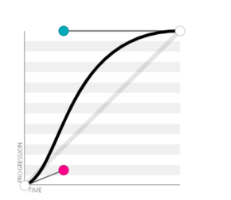
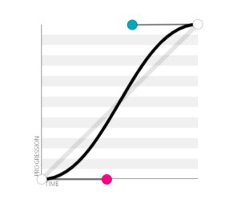
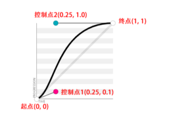

# CSS动画

## CSS3过渡(重点)

>`transition`属性是一个缩写属性,他是`transition-duration`,`transition-delay`,`transition-property`,`transition-timing-function`属性的缩写

* 使用transition属性可以实现元素A状态到B状态的过渡效果,经常使用`:hover`伪类或者`:active`伪类触发

### transition-duration

> transition-duration表示过渡时间,他的值可以是0,但是不能是负值

```css
transition: 1s 0.5s;
```

* 第一个时间1s表示过渡时间,第二个时间表示延时时间(transition-delay).此时不能调换
* 如果延时时间是负数可以调换

```css
transition: 1s -1s;
transition: -1s 1s;
```

### transition-delay

>transition-delay用来延时过渡效果执行的时间,单位是s或者ms,可以是负值

* 如果transition-delay是负值,会使部分动画省略(为负数的时候过渡的动作会从该时间点开始显示)
* 如果是正数会延迟到该时间点执行

<iframe height="300" style="width: 100%;" scrolling="no" title="Untitled" src="https://codepen.io/jack-zhang-1314/embed/QWawmKq?default-tab=html%2Cresult" frameborder="no" loading="lazy" allowtransparency="true" allowfullscreen="true">
  See the Pen <a href="https://codepen.io/jack-zhang-1314/pen/QWawmKq">
  Untitled</a> by Jack-Zhang-1314 (<a href="https://codepen.io/jack-zhang-1314">@jack-zhang-1314</a>)
  on <a href="https://codepen.io">CodePen</a>.
</iframe>

* 元素的位移会从靠近50px的时候开始,且过渡效果执行的时间

### transition-property

>transition-property属性设置应用的CSS属性,初始值是all,表示所有的css属性都应用过渡效果

```css
/* 这个all完全多余 */
transition-property:all 0.2s;
/* 去掉all */
transition-property:0.2s;
```

* <span style="color:red">不过并不是所有的css属性都支持过渡效果</span>.例如display就不会不会支持过渡
* 如果希望元素有过渡效果,同时被隐藏,使用`visibility`

* 如果同时使用多个参与过渡效果的css属性,使用逗号`,`分割
* 但是如果属性值列表长度不同时,有缺则补,多的则除

```css
transition-property:opacity,left,right;
transition-duration:3s,5s;
/* 等同于 */
transition-duration:3s,5s,3s;

transition-property:opacity,left,right;
transition-duration:3s,5s,3s,5s;
/* 等同于 */
transition-duration:3s,5s,3s;
```

* transition简写属性也支持,分割

```css
transition:opacity 5s,transform 3s;
```

### transition-timing-function

1. 线性运动类型:使用`linear`表示
2. 三次贝塞尔时间函数类型:`ease`,`ease-in`,`ease-out`,`ease-in-out`等关键字和`cubic-bezier()`函数
3. 步进时间函数类型:`step-start`,`step-start`等关键字和`steps()`函数

#### 贝塞尔函数

* ease:等同于`cubic-bezier(0.25, 0.1, 0.25, 1.0)`,默认值,表示过渡的时候先加速再减速
  * 横坐标是时间,纵坐标是进程,曲线越陡速率越快,曲线越缓速率越慢
  * 

* `ease-in`:等同于`cubic-bezier(0.42, 0, 1.0, 1.0)`,表示过渡速度刚开始慢,然后过渡速度逐渐加快
  * 

* `ease-out`:等同于`cubic-bezier(0, 0, 0.58, 1.0)`,表 示过渡刚开始速度快,然后速度逐渐变慢
  * 
  
* `ease-in-out`:等同于`cubic-bezier(0.42, 0, 0.58, 1.0)`,表示过渡刚开始速度慢,然后速度逐渐加快,最后再变
慢
  * 

>贝塞尔函数

* 线性贝塞尔曲线,二次方贝塞尔曲 线,三次方贝塞尔曲线,四次方贝塞尔曲线,五次方贝塞尔曲线

* 贝塞尔函数的首位是固定的:分别是`(0,0)`,`(1,1)`

```css
cubic-bezier(x1, y1, x2, y2)
```

* 例如ease关键字对应的贝塞尔曲线函数`cubic-bezier(0.25, 0.1, 0.25, 1.0)`的曲线图就是根据(0.25, 0.1)和(0.25, 1.0)这两个控制点坐标生成的


>贝塞尔曲线有二阶三阶四阶等:他的曲线就是第一个点跑到最后一个点的运动轨迹

* 五阶贝塞尔函数


### transition与visibility属性

>由于visibility属性是支持CSS过渡效果和CSS动画效果的,更适合控制隐藏和显示的效果

1. opacity属性可以实现淡入淡出,但是opacity:0仅仅是在视觉上让浮层元素不可见,浮层元素依然覆盖在页面上,影响
正常的交互,因此,需要使用其他方法来真正隐藏浮层元素
2. display:none不支持过渡效果,因此只能使用 `visibility:hidden`声明来实现

* css支持动画效果的属性:<https://developer.mozilla.org/zh-CN/docs/Web/CSS/CSS_animated_properties>
