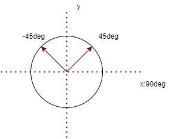
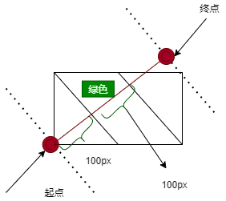

# css

## 线性渐变(liner-gradient())

>渐变的方向需要单独指定.有两种方式,一种可以使用关键字`to`,一种直接使用角度值

* 如果是水平或者垂直渐变,更适合使用`to`
* 渐变的方向:起始方向是从左下角开始的



* 箭头指向的位置就是css渐变中45deg渐变和-45deg渐变角度的示意
* 45deg的渐变方向就是从左下方往右上方

> 渐变的起点和终点

* 渐变的起点位置不是从端点开始的,也不是从元素的某一条边开始,<span style="color:red">而是从渐变角度所在直线的垂直线开始的</span>
* 例如:`linear-gradient(45deg, white 100px, green 200px, white 200px);`



>渐变参数

1. 只传入渐变颜色,默认从水平方向渐变,且渐变线出现在默认总高度的60%
   * 例:`linear-gradient(#fb3 50%, #58a 50%);`
   * 可以传入一个百分比:表示从哪里开始渐变
   * 都是50%相当于平分盒子且没有渐变
2. 第一个参数可以传入一个渐变角度或者渐变名词
   * **渐变轴为45度,从蓝色渐变到红色**
     * `linear-gradient(45deg, blue, red);`
   * **从右下到左上、从蓝色渐变到红色**
     * `linear-gradient(to left top, blue, red);`
3. 多个参数
   * `linear-gradient(0deg, blue, green 40%, red);`
     * 从下到上,从蓝色开始渐变、到高度40%位置是绿色渐变开始、最后以红色结束

* <span style="color:red">过渡的起止分色分别是第一个和最后一个指定值.且颜色不会在某个位置突然变化,而是一个平滑渐变的过程</span>
* 渐变的一个规律:**渐变的值一定要依次递增才会有渐变的效果,依次递减也不可以**

>渐变的断点

1. 渐变的断点至少需要两个值
2. 断点语法中的颜色值和位置值的前后顺序必须是位置值必须在颜色值的后面
3. 没有指定具体断点位置的时候,各个渐变颜色形成的色块是自动等分的
   * `linear-gradient(blue, red,yellow,green);`
4. 断点的位置可以是负数也可以大于100%
5. 不同的类型的断点的位置可以同时使用
   * `linear-gradient(blue 100px,yellow 50%);`
6. 存在多个渐变断点,前面的断点设置的值比后面大时,后面的渐变断点位置会按照前面的断点位置来计算
   * `linear-gradient(blue 20px,yellow 0px,green 40px);`
   * 实际上会按照`linear-gradient(blue 20px,yellow 20px,green 40px);`这个来渲染
7. 渐变断点支持一次性传入两个位置值
   * `linear-gradient(blue 40%,yellow 40% 60%,blue 50%);`
   * 表示这个40%~60%范围内的颜色都是黄色
8. 设置转换点
   * `background: liner-gradient(white,80%,black);`
   * 表示白色和黑色的中心转换点在80%的位置

## 径向渐变(radial-gradient())

>径向渐变是由中心往外部的,默认终止于元素的边框内边缘


* 如果希望水平半径只有50px,垂直半径还是默认大小,可以设置`50px 50%`为第一个参数
  * `background-image: radial-gradient(50px 50%, white, blue);`
  * 如果希望水平半径和垂直半径都是50px,可以直接设置`50px`

* 注意:<span style="color:red">水平半径和垂直半径合写的时候,只能时长度值,不能是百分比值</span>
  * 不合法:`background-image: radial-gradient(50%, white, blue);`

>渐变点的中心位置.使用`at <position>`语法

* 如果想让渐变中心点在左上角,第一个参数可以写以下两种写法
   1. 100px at 0 0
   2. 100px at left top
  * 渐变:图形从左上角以100px的半径开始渐变
  * 如果希望中i先弄点距离右边缘和下边缘100px的位置开始
    * `100px at right 100px bottom 100px`

>渐变的终止点(\<extent-keyword>)

| 属性              | 描述                                                                                                       |
| ----------------- | ---------------------------------------------------------------------------------------------------------- |
| `closest-side`    | 渐变的边缘形状与容器距离渐变中心点最近的一边相切(圆形)或者至少与距离渐变中心点最近的垂直和水平边相切(椭圆) |
| `closest-corner`  | 渐变的边缘形状与容器距离渐变中心点最近的一个角相交.                                                        |
| `farthest-side`   | 与closest-side相反,边缘形状与容器距离渐变中心点最远的一边相切(或最远的垂直和水平边).                       |
| `farthest-corner` | 渐变的边缘形状与容器距离渐变中心点最远的一个角相交.  (默认值)                                              |


* 径向渐变的形状:circle(圆形),ellipse(椭圆).默认值是**ellipse**
  * `radial-gradient(farthest-corner circle at right bottom, white, blue);`
  * 一般不会使用circle和ellipse,会直接使用渐变终止点的关键字

>径向渐变的语法

1. 如果只有一个值,或者出现了circle关键字,后面的值只能是长度值,不能是百分比
   * 不合法:`radial-gradient(circle 50%, white, blue)`
2. circle关键字和ellipse关键字在与半径值或者\<extent-keyword>一起使用的时候,前后的顺序没有要求

## 锥形渐变(conic-gradient())

```css
conic-gradient( [ from <angle> ]? [ at <position> ]?, <angular-color-stop-list> )
```

>锥形渐变由`起始角度`,`中心位置`,`角渐变断点`组成,并且起始角度和中心位置都是可以省略的


* 更改起始角度和中心位置
  * `conic-gradient(from 45deg at 25% 25%,white,blue)`
  * 渐变起始角度45deg,中心位置地洞到了相对于元素左上角25%的位置
* <span style="color:red">角渐变断点只支持角度,不支持长度值</span>

>角渐变断点

* 角渐变断点中设置的角度是一个相对角度值,最终渲染的角度值是设置的角度值和起始角度值的累加
  * 例如:`conic-gradient(from 45deg ,white,blue 45deg,white)`
  * 此时blue实际渲染的坐标角度是90deg(45deg+45deg)

* 同时也支持百分比
  * `conic-gradient(white,blue 45deg,white)`
  * `conic-gradient(white,blue 12.5%,white)`
  * 以上两个效果是一样的

>角渐变转换点(同样可以使用deg或者百分比)

* `conic-gradient(white,12.5%,red)`

```css
/* 获得一个饼图 */
div {
  width: 100px;
  height: 100px;
  border-radius: 50%;
  background: conic-gradient(from 40deg, yellow 40%, green 40% 70%, blue 70% 100%);
}
```

## 重复渐变

>线性渐变,径向渐变,锥形渐变都有对应的重复渐变函数,就是在各自之前增加`repeating`

* `repeating-linear-gradient`
* `repeating-radial-gradient`
* `repeating-conic-gradient`

* 重复渐变与非重复渐变的语法一样,区别在于渲染,非重复渐变的起止颜色位置如果是0%和100%,可以省略,<span style="color:red">但是对于重复渐变,起止颜色位置需要明确定义</span>

```css
.stripe-border { 
  width: 150px; 
  height: 200px; 
  border: 20px solid; 
  border-image: repeating-linear-gradient(135deg, deepskyblue 0 6px, white 7px 12px) 20;
}
```
