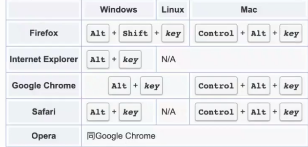
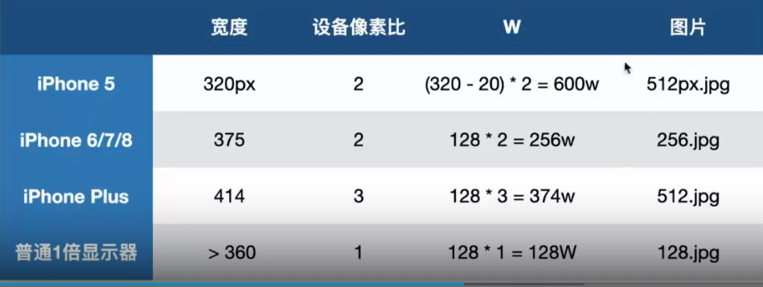

# HTML内置行为和应用

## 属性

>title属性:当鼠标悬停在当前元素上时就会浮出一个层级最高的提示层

* 在移动设备中title属性不会有任何效果

```html
<p title="不读">读书</p>
```

>accesskey:定义任意click访问的快捷点

```html
<!-- Alt + 3文字变为红色 -->
<p accesskey="3" onclick="this.style.color='red'">读书</p>
```



> tabindex

* `tabindex = -1`如果属性为负值,表示当前元素可以被focus,但是不能使用键盘访问
* `tabindex = 0`如果属性值是0,表示可以被focus,按照DOM元素先后位置顺序被按键访问
* `tabindex = 1`如果属性值是正值,则表示可以被focus,同时有优先的键盘访问属性

> srcset:自动根据屏幕宽度和密度加载合适的图片

```html

```



## 表单

> 提交

```html
<form>
  <input name="userid">
</form>
```

* `action`:跳转地址
* `name`:名称字段
* `value`: get/post值

> [验证](https://developer.mozilla.org/en-US/docs/Learn/Forms/Form_validation)

* `required`:需要验证
* `pattern`:需要验证的正则规则
* `maxlength`和`minlength`:限定input最大输入长度和最小输入长度
* `min`和`max`:指定数字输入类型的最小值和最大值
* `invalid`:提交的input元素的值为无效值时,触发oninvalid事件
* `setCustomValidity()`:HTML5内置的JS方法,用来自定义提示信息
* `:invalid`:当匹配模式不为true时,与css伪类响应

```html
<style>
  input:invalid {
    border: red solid 3px;
  }
</style>
<form action="">
  <input type="text" title="格式错误" name="userid" required pattern="\d{6,10}">
  <input type="submit">
</form>
<script>
  const input = document.getElementsByTagName('input')[0]
  input.oninvalid = (e) => {
    if (input.validity.patternMismatch) {
      input.setCustomValidity("请输入6-10位数字")
    }
  }
</script>
```

* `validity`:DOM接口`ValidityState`代表一个元素可有的有效性状态(`validity states`)其与约束验证(`constraint validation`)相关.并且全部是只读属性
  * `badInput`:布尔值,true表示用户提供了浏览器不能转换的输入
  * `customError`:布尔值,表示这个元素的自定义验证信息是否已通过调用元素`setCustomValidity()`方法设置为iyig非空字符串
  * `patternMismatch`:布尔值,如果为true表示元素值不匹配规定的`pattern`,并且可用css伪类`:invalid`匹配
  * `rangeOverflow`:布尔值,true表示值已超过`max`属性规定的最大值,并且可以匹配CSS伪类`:invalid`和`:out-of-range`,false则表示小于或等于这个最大值
  * `rangeUnderflow`:布尔值,true表示值小于`min`属性规定的最小值,并且可以匹配CSS伪类`:invalid`和`:out-of-range`,false则表示大于或等于这个最大值
  * `stepMismatch`:布尔值,true表示值不符合由`step`属性规定的规定,可用CSS伪类`:invalid`和`:out-of-range`匹配.false表示其符合步长值规则.
  * `tooLong`:布尔值,true表示值超过了`HTMLInputElement`或`HTMLTextAreaElement`对象中规定的`maxlength`,可用CSS伪类 `:invalid`和`:out-of-range`匹配,false表示值的长度小于或等于最大长度
    * 注意:这个属性在Gecko中永远不会是true,因为元素值不允许比`maxlength`长
  * `tooShort`:布尔值,true表示值的长度小于`HTMLInputElement`或`HTMLTextAreaElement`对象中规定的`minlength`,可用CSS伪类 `:invalid`和`:out-of-range`匹配,false表示值的长度大于或等于最大长度
  * `typeMismatch`: 布尔值,true表示元素值不满足所需的格式(可见于type是`email`或`url`时),可用CSS伪类`:invalid`和`:out-of-range`匹配,false表示格式正确
  * `valid`:布尔值,true表示元素满足所有的验证约束,并且可用CSS伪类`:invalid`和`:out-of-range`匹配,false表示有任一约束不满足
  * `valueMissing`:布尔值,true表示元素拥有`required`属性,但没有值,可用CSS伪类`:invalid`和`:out-of-range`匹配

## HTML元素

>\<a>锚点定位

1. 当`href="#"`,点击a标签页面会跳到顶端

   ```html
   <a href="#">返回顶部</a>
   ```

2. 当`href="元素id"`,点击a标签会定位到id属性匹配此属性的元素上

   ```html
   <div id="com">跳转到此元素</div>
   ...
   <a href="com">返回顶部</a>
   ```

>平滑跳转:页面不会一闪而过,而是平滑的到达指定的位置(例如锚点跳转)

```css
html,body{
  scroll-behavior: smooth;
}
```

>`target="_blank"`

* 当\<a>标签设置此属性,会在新窗口打开新的标签页

```html
<a href="https://www.google.com" target="_blank">新标签</a>
```

* 当target属性设置为任意相同的属性,那么新开的标签也,会公用同一个标签页
  * 可以有效避免打开多个标签页

```html
<a href="https://www.google.com" target="any">新标签</a>
<a href="https://www.google.com" target="any">新标签</a>
```

>label

1. 嵌套写法

   ```html
   <label>
     <input type="checkbox" hidden>
     <span></span>
   </label>
   ```

   ```css
    [type="checkbox"]+span::before {
      content: "未选择";
      color: red;
    }

    :checked+span::before {
      content: "已选择";
      color: black;
    }
   ```

2. 非嵌套

   ```html
   <input id="t" type="checkbox" hidden>
   <label for="t"></label>
   ```

   ```css
    label::before {
      content: "未选择";
      color: red;
    }

    :checked~label::before {
      content: "已选择";
      color: black;
    }
   ```

> button,`type="reset"`清除表单中的内容

```html
<form>
  <input required><button type="reset">清除</button>
</form>
```

> \<details>:浏览器天然内置的效果

```html
<details>
  <summary>摘要</summary>
  <p>这里是可折叠的内容</p>
</details>
```

* 可以使用`list-style:none`去掉小箭头
