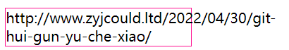

# 文字换行

不同的文字换行是不同的

>如果是汉字,在没有标点的情况下,<span style="color: red;">任意的文字都是换行点</span>;如果有标点,有些标点不能出现在开头,有些标点不能显示在结尾

* **避头标点**:不能出现在开头的标点.例如:逗号,句号,问号,顿号,感叹号等
* **闭尾标点**:不能放在尾部的标点.例如:上引号,上括号等

>英文字符只能在某些特定的中断字符那里才会触发换行

* **Space空格**:unicode值是`U+0020`
* `google`,`safria`,`webview`:短横线(U+002D)<span style="color: red;">后面是字母或者数字,不能是标点</span>,英文问号(U+003F),各种前括号([{
* `firfox`:短横线(U+002D):<span style="color: red;">后面是字母,不能是数字</span>,斜杠(U+002F)
* `Edge`:短横线(U+002D)<span style="color: red;">前后是字符个数大于1的字符单元</span>,连续百分号%

## 文字溢出

> web默认的换行特性带来的连续英文宽度溢出问题

```css
p {
  width: 210px;
  border: 1px solid deeppink;
}
```

```html
<p style="width: 210px;
      border: 1px solid deeppink;">http://www.zyjcould.ltd/2022/04/30/git-hui-gun-yu-che-xiao/</p>
```



* 由于默认特性会在`-`字符换行,只需要加上`word-break:break-all`就可以使单词断行,而不是`-`

>`break-all`断开了单词或者固定词组,因为小部分的场景的排版问题,牺牲了大多数场景的阅读体验

<p class="codepen" data-height="300" data-default-tab="html,result" data-slug-hash="bGLQgMW" data-user="jack-zhang-1314" style="height: 300px; box-sizing: border-box; display: flex; align-items: center; justify-content: center; border: 2px solid; margin: 1em 0; padding: 1em;">
  <span>See the Pen <a href="https://codepen.io/jack-zhang-1314/pen/bGLQgMW">
  break-all</a> by Jack-Zhang-1314 (<a href="https://codepen.io/jack-zhang-1314">@jack-zhang-1314</a>)
  on <a href="https://codepen.io">CodePen</a>.</span>
</p>
<script async src="https://cpwebassets.codepen.io/assets/embed/ei.js"></script>

* **注意**:`word-break:break-all`无法使破折号换行
  * 使用`word-break:break-word`使中文破折号换行(已弃用).现在已使用`overflow-wrap`代替,`word-wrap`现在用作`overflow-wrap`
  * `overflow-wrap`仅会在无法将整个单词放在自己的行而不会移除的情况下才会产生中断

```css
/* 字符换行 */
word-break:break-all;
/* 破折号换行 */
overflow-wrap: break-word;
```

## hyphens

>在英文文字换行的时候自动添加连接符(`-`)

```css
hyphens: none | manual(默认值) | auto;
```

* **注意**:
   1. 英语环境,需要祖先元素设置`lang="en"`
   2. url网址加短横线使我们不希望看到的
   3. Chrome浏览器只有Android和Mac下才有效

* 两种连字符
  * **硬连字符**:(U+2010),可见换行机会
  * **软连字符**:(U+00AD),不可见换行机会.<span style="color: red;">需要换行时候连字符才出现,不需要换行的时候连字符隐藏</span>
    * 在HTML中使用`&shy;`表示软连字符.只适用于英文字符换行,不适用于url换行

>\<wbr>\</wbr>:表示有机会才换行

* 原理:创建了一个Unicode编码为U+200B的0宽换行空格

```css
wbr:after{
  content:"\00200B";
}
```

## 总结

* 动态内容:使用`word-break:break-all`;`overflow-wrap:break-all`来进行换行
* 静态内容:排版英文单词使用`&shy`;软连字符优化排版;如果使非英文单词,使用\<wbr>标签优化排版

1. 中文都是换行点的情况(中文默认都是换行点).`word-break:keep-all`中文不再换行
2. 避首避尾标点不是换行点.`line-break:anywhere`首尾标点是换行点
3. 连续破折号不是换行点.`overflow-wrap:break-word`
4. 空格是换行点.`white-space:nowrap`空格不再换行.由于中文之后的换行点也是插入`\n`,所以也可以改变中文不再换行
5. 英文单词不是换行点`word-break:break-all`
6. 部分引文标点不是换行点.`overflow-wrap:anywhere`:使部分英文标点成为换行点(如`'`)
