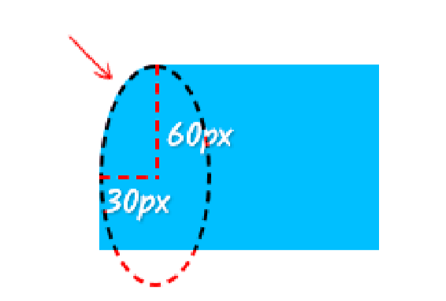
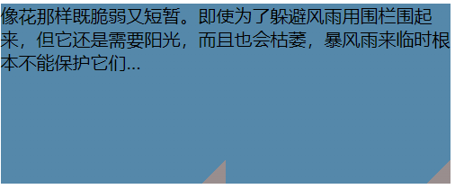

# 形状

## 自适应椭圆

>利用`border-radius`很容易得到圆角的属性

* 利用圆角属性很容易画出**圆和椭圆**

```css
.circular {
  height: 300px;
  width: 300px;
  background-color: violet;
  border-radius: 50%;
}
.oval {
  height: 200px;
  width: 300px;
  background-color: violet;
  border-radius: 50%;
}
```

### border-radius

1. `border-radius`:是以下属性的简写.他的值会以左上角以顺时针顺序应用到各个拐角
   1. `boreder-top-left-radius`
   2. `boreder-top-right-radius`
   3. `boreder-bottom-right-radius`
   4. `boreder-bottom-left-radius`
2. `boeder-radius`参数值的情况
   1. 只有一个值:表示应用于全部四个角
   2. 两个值:第一个值作用于左上角和右下角,第二个值作用于右上角和左下角
   3. 三个值:第一个值作用于左上角,第二个值作用于右上角和左下角,第三个值作用于右下角
   4. 四个值:从左上角按顺时针顺序一次作用于各个角
3. 可以为四个角提供完全不同的水平和垂直半径
   * 如果是border-radius的缩写形式
      * 斜杠前(/)指定`1~4`个值,(/)后指定`1~4`个值
      * 例如`border-radius:10px/5px 20px`,相当于`10px 10px 10px 10px/5px 20px 5px 20px`
   * 如果是`boreder-top-left-radius`,使用空格区分.
      * `boreder-top-left-radius:10px 20px`:第一个表示水平半径,第二个表示垂直半径

* `boreder-top-left-radius:30px 60px`
* 本质上讲:这个圆角属性,是按照水平半径30px和垂直半径60px的椭圆产生的
  * 

* 如果`boreder-top-left-radius:10px 100%`那么垂直半径就是整个元素的高度

>重叠曲线的渲染机制

```css
/* 假设高宽都是150px */
boreder-top-left-radius:30px 100%;
boreder-bottom-left-radius:30px 100%;
```

* 显然元素的高度并不足以放下两个半轴为100%尺寸的椭圆,如果我们对这种场景不加以约束,则曲线不一定会发生重叠,而且曲线的交叉一定不是平滑.
* 所以css会有一个具体算法解决这个问题`f=min(Lh/Sh,Lv/Sv)`其中S是半径之和,L是元素高宽,下标h和v表示方式
  * 上面这个例子,垂直半径都是100%.水平半径都是30px.因此`f=min(150px/60px,100%/200%)=0.5`f计算值是0.5,所有的圆角值都要乘以0.5
  * 所以这就等同于

  ```css
  boreder-top-left-radius:15px 50%;
  boreder-bottom-left-radius:15px 50%;
  ```

* 例如一个高度是100px,宽度是150px的一个长方体
  1. 如果`border-radius:100%`,计算值是0.5,而垂直最终的圆角半径都要乘以0.5
     * `border-radius:75px /50px;`
  2. 如果`border-radius:150px`,水平方向L/S的计算值是150px/300px=0.5.但是垂直方向的L/S计算值是`100/300`.是1/3.所以最终的圆角半径都要乘以1/3
     * `border-radius:50px;`

* 其它的一些注意点
  1. `border-radius`不支持负值
  2. 圆角以外的区域不可点击,无法响应click事件
  3. `border-radius`没有继承性,因此元素设置了`border-radius`,子元素依然是直角.可以给父元素设置`overflow:hidden`让子元素产生视觉上的圆角
  4. `border-radius`属性支持transition过渡效果,也支持animation

> 半椭圆


1. 这个形状垂直对称.<span style="color:red">左上角和右上角的半径相同,左下角和右下角的半径相同</span>
2. 水平方向上:左上角和右上角整个顶部都是曲线,可以看出左右两个角平分整个形状的宽度(使用50%)
3. 垂直方向上:左下角和右下角没有任何圆角(0).并且左上角和右上角占据了整个元素的高度(100%)

```css
.halfElliptical {
  width: 100px;
  height: 200px;
  background-color: violet;
  border-radius: 50% 50% 0 0/100% 100% 0 0;
}
```

* 水平方向的半椭圆也很容易了

```css
border-radius: 100% 0 0 100%/50% 0 0 50%;
```

> 四分之一的椭圆也就唾手可得

```css
border-radius:100% 0 0 0;
```

## 平行四边形

>**skew()**:两种简写形式:`skewX()`,`skewY()`

1. `skewX()`:表示在X轴方向的倾斜程度.单位deg.如果是正数则表示元素沿X轴逆时针倾斜;如果是负数,则表示元素眼x轴顺时针倾斜
2. `skewY()`:表示在Y轴方向的倾斜程度.单位deg.如果是正数则表示元素沿y轴顺时针倾斜;如果是负数,则表示元素眼x轴逆时针倾斜

### 伪元素

>当我们使用`skew()`的时候,整个平行四边形都发生变形,其中内容也会发生变形.

* 将所有的样式(背景,边框等)应用到伪元素,然后对伪元素进行变形
* 设置宿主的`position:relative`样式,并设置伪元素`position:absolute`,然后把所有偏移量都设置为0

```css
.parallelogram {
  width: 200px;
  height: 100px;
  position: relative;
  font-size: 5rem;
}
.parallelogram::before {
  position: absolute;
  right: 0%;
  left: 0%;
  bottom: 0%;
  top: 0%;
  content: '';
  background-color: violet;
  transform: skew(20deg, 0);
  z-index: -1;
}
```

## 菱形图片

>`rotate()`,元素按中心顺时针旋转.单位`deg`

1. 图片不能根据父元素旋转,需要保持不变.所以不能使用伪元素,伪元素会紧跟着父元素变化
2. 只能子元素旋转父元素旋转的负角度

```css
.picture {
  width: 25rem;
  height: 25rem;
  transform: rotate(45deg);
  overflow: hidden;
}
.picture>img {
  width: 100%;
  height: 100%;
  transform: rotate(-45deg);
}
```

>* 问题是图片被原来的旋转后的大小切割,这里要使用`scale()`来放大图片,使菱形更合理
>* 放大的图片应该约等于原来图片的1.42倍,旋转45°,增大根号2倍

```css
transform: rotate(-45deg) scale(1.42);
```

### 裁切路径

>使用`clip-path`属性:允许把元素裁剪为任何想要的形状.使用`polygon()`函数来指定一个菱形

* **polygon()**:它的参数是一组坐标对，每一个坐标对代表多边形的一个顶点坐标(坐标对的第一个是x轴,第二个是y后)。浏览器会将最后一个顶点和第一个顶点连接得到一个封闭的多边形。坐标对使用逗号来进行分隔，可以使用绝对单位或百分比单位值
* 坐标的原点是以图片的左上角开始的
* 以顺时针依次裁剪

```css
img {
  height: 25rem;
  width: 25rem;
  clip-path: polygon(50% 0, 100% 50%, 50% 100%, 0 50%);
}
```


## 切角效果

> 使用渐变来达到这个效果(渐变可以接好一个角度,比如45deg)

* 渐变需要把一个透明色标放在色角处,然后在相同的位置另一个色标,并且把它的颜色设置为我们想要的背景颜色

```css
.cornerCut {
  width: 25rem;
  height: 10rem;
  margin: 0 auto;
  background: linear-gradient(-45deg, transparent 15px, #58a 0);
}
```

> 设置两个角的切角效果(由两个切角也很容易想到四个切角的效果)

1. 以底部两个角为例,如果只用一层渐变是无法做到的,所以再加上一层

   ```css
   background: linear-gradient(-45deg, transparent 15px, #58a 0);
   background: linear-gradient(45deg, transparent 15px, #655a 0);
   ```

   * 这样写会导致这两层渐变都会相互覆盖
2. 让元素缩小,并且使用`background-size`让每层渐变分别指占据整个元素的一半面积
   * 设置左下角的渐变就在左侧,右下角的渐变就在右侧

   ```css
   .cornerCut {
       width: 25rem;
       height: 10rem;
       margin: 0 auto;
       background: linear-gradient(-45deg, transparent 15px, #58a 15px) right,
         linear-gradient(45deg, transparent 15px, #655a 15px) left;
       background-size: 50% 100%;
     }
   ```

   

   * 由于`background-repeat`属性的默认属性是`repeat`,会导致默认平铺依然是铺两次

3. 将`background-repeat`改成`no-repeat`只平铺一次

   ```css
   background-repeat:no-repeat;
   ```

### 弧形切角

>该图像是由从原点发出的两种或者多种颜色之间的逐步过渡组成(形状可以是圆形或椭圆形)

* 组成:径向渐变(Radial gradients)由其中心点,边缘形状轮廓,两个或多个色值结束点(color stops)定义而成

>第一个参数是**可选的**.`shape size at position`默认参数(ellipse farthest-corner at center)

1. `shape`:确定圆的类型

   | 属性           | 解释                   |
   | -------------- | ---------------------- |
   | ellipse (默认) | 指定椭圆形的径向渐变。 |
   | circle         | 指定圆形的径向渐变     |

2. `size`:定义渐变的大小

   | 属性                  | 解释                                           |
   | --------------------- | ---------------------------------------------- |
   | farthest-corner(默认) | 指定径向渐变的半径长度为从圆心到离圆心最远的角 |
   | closest-side          | 指定径向渐变的半径长度为从圆心到离圆心最近的边 |
   | closest-corner        | 指定径向渐变的半径长度为从圆心到离圆心最近的角 |
   | farthest-side         | 指定径向渐变的半径长度为从圆心到离圆心最远的边 |

3. `position`:定义渐变的位置(可以是像素,百分比,关键字等)

   | 属性         | 解释                               |
   | ------------ | ---------------------------------- |
   | center(默认) | 设置中间为径向渐变圆心的纵坐标值。 |
   | top          | 设置顶部为径向渐变圆心的纵坐标值。 |
   | bottom       | 设置底部为径向渐变圆心的纵坐标值。 |
   ...

> 其它参数是必选的(用于设定渐变的颜色),由两个属性组成

1. 渐变的颜色
2. 渐变的方向,可以传入`像素`或者`百分比`

>了解以上的概念可以很容易的得到一个**弧形的切角**

### 裁剪路径

>从菱形图片中得到启示

```css
.conerCut {
  width: 300px;
  height: 300px;
  background-image: url(./img/0.jpg);
  clip-path: polygon(20px 0,
      calc(100% - 20px) 0,
      100% 20px,
      100% calc(100% - 20px),
      calc(100% - 20px) 100%,
      20px 100%,
      0 calc(100% - 20px),
      0 20px);
  background-size: cover;
}
```

>以上两种方法各有优缺点

1. 使用裁剪路径的方案,当内边距<span style="color:red">不够宽时,他会裁剪掉文本</span>,所以他只能对元素做统一的裁剪,并不能区分元素的各个部分
2. 使用渐变方案,允许文字超出切角区域(因为他只是改变背景图案)

## 梯形标签页

>`perspective`:指定考虑观察者与`z=0` 平面的距离,使具有三维位置变换的元素产生透视效果

1. `z>0`的三维元素比正常大,`z<0`的三维元素比正常小
2. 三维元素在观察者后面的部分不会绘制出来,即z轴坐标值大于`perspective`属性值的部分
3. 默认情况,小食店位于元素的中心,但是可以通过`perspective-origin`属性来改变其位置

>利用透视,很容易就能生成一个梯形

```css
.trapezoidal {
  width: 200px;
  height: 100px;
  position: relative;
  color: white;
  margin-left: 150px;
  text-align: center;
  line-height: 100px;
}
.trapezoidal::before {
  content: "";
  position: absolute;
  top: 0;
  left: 0%;
  bottom: 0%;
  right: 0%;
  background-color: #58a;
  transform: perspective(0.5rem) rotateX(5deg);
  z-index: -1;
}
```

* 但是我们并没有设置`transform-origin`属性时,应用变形效果(rotateX)会让这个元素以自身的中心线为轴进行空间上的旋转.因此,元素投到2D屏幕上的尺寸会有多种变化.例如他的宽度稍稍增加,他占据的位置就会下移等等

>`transform-origin`属性值表示更改一个元素变形的原点.可以使用1个,两个或三个值来指定,其中每一个值都表示一个偏移量

* 如果顶一个了两个或更多的值并且灭有值的关键字,或者唯一使用的关键字是`center`,则第一个值表示水平偏移量,第二个值表示垂直偏移量

1. 一个值:必须是\<length>,百分比,或者如left,right的关键字
2. 两个值:代表的是x轴和y轴的偏移量
   * 值必须是\<length>,百分比,或者如left,right的关键字
3. 三个值:第三个值代表的是Z轴的偏移量,必须是`\<length>`
   * 前两个值和只有两个值时的用法相同

* 这样就可以通过变形属性来更改他的尺寸.同时可以使用`scaleY()`变形属性来控制垂直方向上的缩放程度

```css
transform:scaleY(1.3) perspective(0.5rem) rotateX(5deg)
transform:bottom
```

## 简单的饼图

> 左右两部分分别指定不同的两种颜色,然后使用伪元素覆盖上去,通过旋转来决定露出多大的扇区

1. 首先很容易就能得到一块饼图

   ```css
   .pieChart {
     width: 200px;
     height: 200px;
     border-radius: 50%;
     background: green;
     background-image: linear-gradient(90deg, transparent 50%, #655 50%);
   }
   ```

2. 使用伪元素对左半边饼图进行重叠
   * 遮盖图形中的棕色部分,并同样给他指定绿色的背景
   * 同时我们希望他是绕着圆心来旋转的(中心在左半边的中点处)
   * 同时不希望它呈现矩形的形状,否则会突破整个饼图的圆形范围(使用`border-radius`将矩形变成半圆,首先他的水平方向是100%,垂直方向对半分50%)

   ```css
   .pieChart::before {
      content: "";
      display: block;
      margin-left: 50%;
      height: 100%;
      background-color: inherit;
      border-radius: 0 100% 100% 0 /0 50% 50% 0;
      transform-origin: left;
    }
   ```

   * 使用`rotate()`变形属性旋转伪元素.更好使用`turn`单位(`72deg=0.2turn*360°`).
   * 当我们的旋转超过`0.5turn`的时候就出现问题了

> 使用动画,并使其隐藏就可以得到一个正真的饼图

* 如果使用多个颜色的饼图,可以使用`conic-gradient()`角向渐变来完成
