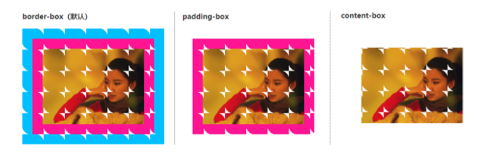
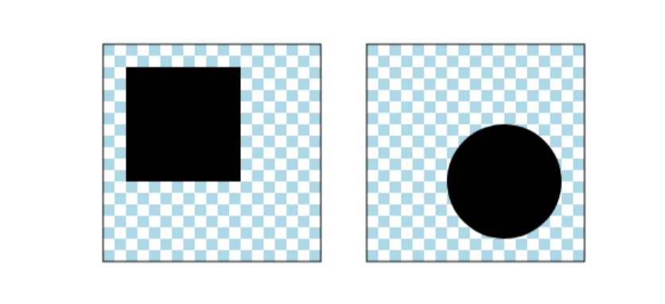
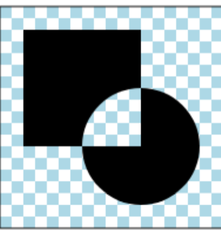
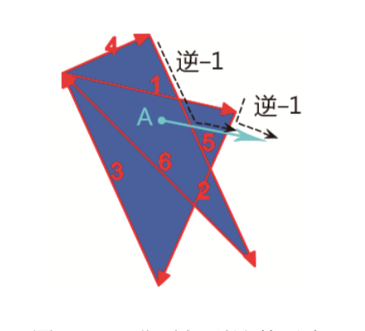

# 图形处理

## css遮罩

>css遮罩属性非常实用,它可以让一个元素按照某张图像的轮廓显示.有很多图形表现效果只能使用遮罩实现

* 目前使用css遮罩需要设置`-webkit-`私有前缀

### mask-image

* 语法:`mask-image: none | <image> | <mask-source>`
  * `none`:默认值,表示默认无遮罩图片
  * `<image>`:表示图形数据类型,包括css渐变图像,url()函数,image-set()函数等
  * `<mask-source>`:表示遮罩元素类型,主要指SVG遮罩元素

>半透明的PNG图像的遮罩效果

```html
<style>
  .mask-image{
    mask: no-repeat center / contain;
    mask-image: url(1.png);
  }
</style>

```

* 所谓的遮罩效果只会显示遮罩图像非透明区域的内容
  * 例如用来实现遮罩效果的图像不是透明背景的png图片,而是白色背景图片的jpg图片,遮罩效果将会是整个矩形

>SVG图形遮罩效果

* 除了常见的GIF,PNG等位图图片,SVG矢量图也可以作为mask-image的遮罩图像
* svg图像作为背景图像,遮罩图像和内容图像的时候,会按照当前匹配元素的尺寸进行等比例缩放

>渐变图像实现遮罩效果

* 使用渐变图像实现遮罩效果十分常见,也十分实用

```html
<style>
.mask-image {
  width: 256px;
  height: 192px;
  -webkit-mask-image: radial-gradient(600px 80px at top, transparent 150px, black 152px 1000px, transparent 0),
    radial-gradient(600px 80px at bottom, transparent 150px, black 152px 1000px, transparent 0);
}
</style>

```

>image-set(),cross-fade()或者element()作为遮罩

1. image-set()函数语法

   ```css
   .mask-set{
      -webkit-mask-image: -webkit-image-set(url(bird.png) 1x,url(ellpse-rect.svg) 2x);
   }
   ```

   * 表示1倍屏中使用`brid.png`作为遮罩图像,2倍屏中使用`ellpse-rect.svg`作为遮罩图像

2. `cross-fade()`

   ```css
   .mask-set{
      -webkit-mask-image: -webkit-cross-fade(url(bird.png),url(ellpse-rect.svg) 50%);
   }
   ```

   * 表示`ellpse-rect.svg`保持50%的透明度进行遮罩渲染

3. `element()`

   ```css
   .mask-set{
      -webkit-mask-iamge: -webkit-element(#title);
      mask-image: -moz-element(#title);
      mask-image: element(#title);
   }
   ```

   * 把id属性值是title的元素作为遮罩图像进行处理

### mask-mode(只有火狐支持)

>mask-mode属性的默认值是**match-source**,作用是根据资源的类型自动采用合适的遮罩模式

* 如果是svg中的\<mask>元素,则此时的mask-mode的计算值是`luminance`,表示基于亮度是否要进行遮罩
* 如果是其他场景,则计算值是alpha,表示基于透明度判断是否要进行遮罩
* 支持下面三个属性

```css
mask-mode: match-source;
mask-mode: luminance;
mask-mode: alpha;
```

* mask-image支持多图片,因此mask-mode也支持多属性值
* 例如:`mask-mode: alpha,match-source;`
* 使用搜索引擎搜索遮罩素材的时候,往往搜索的结果都是白底的jpg图片,因此使用默认的遮罩模式是没有预期效果的.此时就可以使用`luminance`

```html
<style>
  .mask-image{
    mask: url(bird.jpg) no-repeat center/contain;
    mask-mode: luminance;
  }
</style>

```

### mask-repeat

>mask-repeat:默认值是`repeat`.类似于background-repeat

* mask-repeat支持一下一些单属性值

```css
mask-repeat: repeat-x;
mask-repeat: repeat-y;
mask-repeat: repeat;
mask-repeat: no-repeat;
mask-repeat: space;
mask-repeat: round;
```

* 并且可以同时表示x,y轴

```css
mask-repeat: repeat space;
mask-repeat: repeat repeat;
mask-repeat: round space;
```

* 由于mask-image支持多遮罩图片,因此mask-repeat也支持多属性值

```css
mask-repeat: round repeat, space, repeat-x;
```

* `repeat-x`表示水平方向平铺
* `repeat-y`表示垂直方向平铺
* `repeat`默认值,表示水平和垂直方向均平铺
* `no-repeat`不平铺,会看到只有一个遮罩图形位于左上角
* `space`,与background属性中的space含义类似,表示遮罩图片尽可能的平铺,同时不进行任何裁剪
* `round`,表示遮罩图片尽可能的靠在一起,没有任何间隙,同时不进行任何裁剪,意味着图片可能会进行缩放

### mask-position

>mask-position和background-position支持的属性值和属性值的表现基本一模一样

* 并且mask-position的默认定位也是`0% 0%`,相对于左上角定位的
* mask-position支持单个关键字,缺省的关键字被解析为center
* 也支持垂直和水平方向的关键字,可以使用长度或者百分比

   ```css
   mask-position:30% 50%
   mask-position:left top;
   mask-position:left 20px top 50px;
   ```

### mask-clip

>mask-clip属性用来设hi遮罩效果显示的盒子的区域

* mask-clip和background-clip属性的性质类似.默认值都是`border-box`,都不支持`margin-box`,都支持多属性
* 例如:`mask-clip: content-box,border-box`

```css
mask-clip: border-box; 
mask-clip: padding-box; 
mask-clip: content-box;
mask-clip: no-clip;
mask-clip: fill-box;
mask-clip: stroke-box; 
mask-clip: view-box;
```

> border-box,padding-box和content-box

* 比较有实用价值的.chrome浏览器也仅支持这三个关键字
* 这三个属性和`background-clip`支持的属性是一样的

```html
<style>
  .mask-image { 
    width: 200px; height: 150px; 
    border: 20px solid deepskyblue; 
    padding: 20px; 
    box-shadow: 20px 0, -20px 0; 
    /* 测试no-clip */
    background-color: deeppink;
    mask-image: url(border-arc.png); 
  }
</style>
 
```

* 

>no-clip

* 他的作用不是对元素的遮罩效果做区域上的限制,只要是元素范围内的,都可以应用遮罩效果
  * 例如:轮廓(`outline`),盒阴影(`box-shadow`)都是可以用遮罩效果
  * 当使用`no-clip`的效果
  * 

>关于`fill-box`,`stroke-box`和`view-box`

* 这三个属性需要实用在svg上才会有效果

1. `fill-box`表示遮罩应用的区域是图形填充区域形成的盒边界
2. `stroke-box`表示遮罩区域把描边占据的区域也包含在内
3. `view-box`:表示使用最近的svg视口作为参考盒子.
   * 如果svg代码中的viewBox属性有设置,则遮罩区域盒子位于viewBox属性建立的坐标系的原点,尺寸由`viewBox`属性中的宽高值决定

### mask-origin

>mask-origin属性表示遮罩效果起始点,与background-origin相似

```css
mask-origin: content-box;
mask-origin: padding-box; 
mask-origin: border-box;
mask-origin: fill-box;
mask-origin: stroke-box;
mask-origin: view-box;
```

* 默认值是`border-box`,并且同时支持多属性

```css
margin-origin: content-box, border-box;
```

* mask-orgin和mask-clip属性值类似以及含义也是一样的

### mask-size

>mask-size属性的性质和background-size属性类似,支持的关键字属性值也类似,作用是控制遮罩图片尺寸

* `mask-size`:属性的默认值是`auto`,支持`contain`和`cover`两个关键字属性值
* 同时支持长度值和百分比值(垂直方向的尺寸值如果省略,会自动计算为auto)

```css
mask-size: 50%; 
mask-size: 3em; 
mask-size: 12px;

mask-size: 50% auto;
mask-size: 3em 25%;
mask-size: auto 6px;
```

* 同样支持多个属性值

```css
mask-size: 50%, 25%,25%;
mask-size: 6px, auto, contain;
```

### mask-type

* mask-type属性功能和mask-mode类似,都是设置不同的遮罩模式,但是区别就是`mask-type`只能使用于`SVG`元素上
* 并且是所有浏览器都提供支持
* 属性和mask-mode一样

### mask-composite

>mask-composite属性表示同时使用多张图片进行遮罩时的合成

```css
mask-composite: add; 
mask-composite: subtract; 
mask-composite: intersect;
mask-composite: exclude;
```

* `add`:表示遮罩累加,默认值
* `subtract`:表示遮罩相减,也就是遮罩图片重合的区域不显示
* `intersect`:表示遮罩相交,也就是遮罩图片重合的区域才显示遮罩
* `exclude`:表示遮罩排除,也就是遮罩图片重合的区域被当作透明的

>假设两个图像,正方形和圆

* `mask-image:circle.svg,rect.svg`
* 
* 代码中顺序越往后的图像层级越低,因此rect位于circle的下方
  * 在w3c的规范中,处于上方的元素为`source`,表示资源元素.处于下方的元素称为`destination`,表示目标元素

1. add表示两者共同组成最终的遮罩图像`source over`
   * 
2. `subtract`:表现为`source out`.扣除`circle.svg`覆盖的区域,最终表现为`circle.svg`和`rect.svg`重叠的区域消失
   * 
3. `intersect`:表现为`source in`,也就是circle.svg和rect.svg重叠的部分作为遮罩区域
   * 
4. `exclude`:表现为`xor`,也就是最终合成的遮罩区域是非重叠的部分
   * 
   * exclude经常用于渐变图像,可以实现反向遮罩的效果,并且经常用于镂空的遮罩效果

>并且mask-composition属性值和Firefox是不一样的,并且需要加`-webkit-`

* `source-over`:表示遮罩区域累加,效果和CSS规范中的add值是一样的
* `source-in`表示遮罩区域是交叉重叠的区域,效果和CSS规范中的intersect值是一样的
* `source-out`表示遮罩区域是上层图像减去其和下层图像重叠的区域,效果和CSS规范中的subtract值是一样的
* `source-atop`表示保留底层图像区域,并在其上方累加上层和下层图像重叠的区域
* `destination-over`表示下层遮罩图像叠加在上层遮罩图像上由于默认的遮罩模式是基于alpha通道计算的(基于透明度计算)因此source-over和destination-over效果都是一样的,除非遮罩模式是基于亮度计算的,两者才会有明显的区别

* `destination-*`这几个值和上面`source-*`几个属性值的区别就是,`source-*`是上层图像对下层图像如何,而`destination-*`是下层图像对上层图像如何,可以理解为上下层图像的位置调换

* `destination-in`表示遮罩区域是交叉重叠的区域
* `destination-out`表示遮罩区域是下层图像减去其和上层图像重叠的区域
* `destination-atop`表示保留上层图像区域,并在上方累加上层和下层图像重叠的区域
* `xor`表示上层图像和下层图像重叠的区域透明,效果和CSS规范中的exclude属性值是一样的
* `copy`表示忽略下层图像,只使用上层图像区域作为遮罩区域
* `plus-lighter`不详,规范文档中并没有任何相关的描述应该表示自然光混合效果,适合用在mask-sourcetype属性值为luminance的场景下
* `clear`不详.当遮罩图像有多张的时候,最终的遮罩效果是完全透明的

### -webkit-mask-box-image和mask-border

>-webkit-mask-box-image和mask-border都是实现边框遮罩效果的.有以下区别

* 语法细节不同例如,`-webkit-mask-box-image`的属性值使用空格分隔,不会用到斜杠,而mask-border属性是多个CSS属性的缩写,会使用斜杠进行属性值的区分
* `-webkit-mask-box-image`是非标准CSS属性,`mask-border`是标准CSS属性
* `-webkit-mask-box-image`属性在webkit内核浏览器中兼容性极佳,因此,在移动端项目可以放心大胆使用;而mask-border属性在我书写这段内容的时候还没有被任何浏览器支
持,暂无实用价值

>-webkit-mask-box-image

* border-image属性表示边框图像,而-webkit-mask-box-image属性则表示边框遮罩

```css
-webkit-mask-box-image: none; 
-webkit-mask-box-image: <mask-box-image> [<top> <right> <bottom> <left> <x-repeat> <y-repeat>]
```

* `<mask-box-image>`表示用来实现边框遮罩效果的图像,可以是url()图像,也可以是渐变图像
* `<top> <right> <bottom> <left>`表示遮罩图像4个方向上各自的剪裁划分的偏移大小,可以是数值或百分比值
  * 无论是语法还是含义都和border-image-slice属性很类似,可以把遮 罩图像划分成9份,像九宫格那样,依次填入元素的边框区域中\<x-repeat>\<y-repeat>表示各个方向边框遮罩图像的平铺方式,支持`repeat,stretch,round,space`等关键字属性值
* 理解norder-image就明白了mask-border-image

>mask-border

* `mask-border-mode`
* `mask-border-outset`
* `mask-border-repeat`
* `mask-border-slice`
* `mask-border-source`
* `mask-border-width`

1. `mask-border-mode`支持边框遮罩的模式,支持`alpha`和`luminance`这两个关键字属性,分别表示遮罩效果是基于偶名都还是亮度
2. `mask-border-outset`表示边框遮罩效果向外偏移的大小,支持长度值和数值,如果是数值,则表示边框宽度`border-width`属性值的倍数

   ```css
   /* 长度值 */ 
   mask-border-outset: 2rem; 
   /* 数值 */ 
   mask-border-outset: 1.5; 
   /* 垂直 | 水平 */ 
   mask-border-outset: 1 1.2; 
   /* 上 | 水平 | 下 */
   mask-border-outset: 30px 2 25px; 
   /* 上 | 右 | 下 | 左 */
   mask-border-outset: 10px 20px 15px 5px;
   ```

3. `mask-border-repeat`表示遮罩图像的平铺方式,支持stretch,repeat,round,space等
   * 默认值是`stretch`
4. `mask-border-slice`属性表示对遮罩图像进行九宫格划分的方式,支持4个方位的划分,支持的参数值类型和效果与`border-image-slice`属性一致
5. `mask-border-source`:表示使用遮罩图像的资源,支持任意的\<image>数据类型的图像,例如`url()`和渐变图
6. `mask-border-width`:表示合照效果应用的宽度,支持长度值和百分比

>mask-border属性的缩写语法和border-image基本一致,只是多列一个`mask-border-mode`

```css
/* source | slice */ 
mask-border: url('border-mask.png') 25; 
/* source | slice | repeat */ 
mask-border: url('border-mask.png') 25 space; 
/* source | slice | width */ 
mask-border: url('border-mask.png') 25 / 35px;
 /* source | slice | width | outset | repeat | mode */
mask-border: url('border-mask.png') 25 / 35px / 12px space alpha;
```

## clip-path

>clip-path可以对任意元素的可视区进行裁剪

* `clip-path`不需要将元素设置为绝对定位就可以生效,并且裁剪的形状远比clip属性要丰富

```css
clip-path: none | <clip-source> | <geometry-box> | <basic-shape>;
```

### clip-source

>对于资源裁剪,本质上就是对SVG的裁剪,实现小图标

* 可以将图片,按钮和文字等元素全部裁剪成为小图标的形状,支持任意的裁剪效果
* 并且内联的svg元素不能使用`display:none`或者`visibility:hidden`,否则裁剪元素不会被隐藏

### geometry-box

>对于盒子裁剪.只需要关心margin-box,border-box,paddingbox和content-box这几个盒子类型即可

* fill-box,strokebox和view-box这3个盒子类型需要和SVG元素配合使用

```css
clip-path: padding-box polygon(50% 0%, 100% 100%, 0% 100%);
```

### basic-shape

>基本图形剪裁是clip-path属性高频使用的一种剪裁方式,其可以实现剪裁效果的基本形状函数包括inset(),circle(),ellipse(),polygon()和path()

1. 使用`inset()`函数可以裁剪出矩形和圆角矩形形状,他是和clip属性的rect()函数关系最近的一个函数

   ```css
   .clip-me { 
     /* rect()函数 */ /* position:fixed亦可 */ 
     position: absolute; clip: rect(30px 150px 150px 20px);
     /* inset()函数,无须定位属性 */ 
     clip-path: inset(30px 150px 150px 20px);
   }
   ```
  
   * inset()函数的四个值分别对应元素的四个方位,分别是上左下右
   * 并且还支持圆角设置`inset(<length-percentage>{1,4} round <'border-radius'>);`

   ```css
   /* 偏移大小15%,圆角大小10% 50% 10% 50%*/
   clip-path: inset(15% round 10% 50% 10% 50%);
   ```

   * 其中15%是裁剪偏移大小,round之后是圆角的大小

   * `inset()`函数中的圆角也支持内圆角和外圆角,或者这么说吧:凡是`border-radius`属性支持的圆角值,inset()函数也都支持

   ```css
   img { 
     clip-path: inset(15% 0% 15% 30% round 50% 50% 0% 0% / 100%100% 0% 0%);
   }
   ```

2. `circle()`函数可以用来剪裁圆形形状
   * 也可以不设置任何参数,直接使用`circle`函数

   ```css
   circle( [ <shape-radius> ]? [ at <position> ]? )
   ```

   * circle()函数可以指定圆心的位置,轻松实现任意大小的1/2圆形或者1/4圆形剪裁效果

   ```css
   /* 以右下角为圆心进行圆形剪裁 */ 
   img { 
     clip-path: circle(180px at right bottom);
   }
   /* circle()函数的半径值支持百分比值 */
   clip-path: circle(40% at right 10% bottom 10%);
   ```

3. `ellipse()`函数可以用来剪裁椭圆形状
   * `ellipse()`函数和`circle()`函数的区别在于前者多了一个半径(半轴)值.与`circle()`函数一样,`ellipse()`函数中的参数值都是可以省略的

   ```css
   ellipse( [ <shape-radius>{2} ]? [ at <position> ]? )
   ```

   * ellipse()函数的半径(半轴)值同样支持百分比值

   ```css
   img { 
     clip-path: ellipse(30% 50% at 75% 50%);
   }
   ```

4. `polygon()`函数
   * \<fill-rule>数据类型表示填充规则,值可以是nonzero或evenodd.默认是具体的就够用了
   * polygon()函数可以用来剪裁任意的多边形和任意的非曲线图形,甚至在线条足够多的情况下,可以一定程度上模拟曲线效果

   ```css
   polygon( <fill-rule>? , [ x, y ]# )
   /* 使用*/
   polygon(x0 y0, x1 y1, x2 y2, x3 y3, ... )
   ```

5. `path()`函数可以裁剪出任意图形的效果
   * \<string>指路径字符内特

   ```css
   path( [ <fill-rule>, ]? <string> )
   ```

   ```html
   <style>
     .icon-arrow { 
      width: 32px; height: 32px;
     background: linear-gradient(45deg, deepskyblue, deeppink);
     clip-path: path("M16.016 1.157l-15.01515.015h9.009v16.016h12.012v-16.016h9.009z"); transition: .2s;
     }
     .icon-arrow:active {
       clip-path: path("M16.016 31.187l15.015-15.015h-9.009v-16.016h12.012v16.016h-9.009z");
     }
   </style>
   <button class="icon-arrow"></button> 
   ```

>* 剪裁效果发生的时候,元素原始的位置是保留的,不会发生布局上的变化,这为clip-path属性在图形动态效果领域打下了技术基础
>* 被剪裁的区域不能响应点击行为,也不能响应:hover伪类和:active伪类.这一点和mask属性不同,元素应用mask属性遮罩效果后,透明的部分依然是可以点击的
>* clip-path属性的几个基本图形函数都是支持动画效果的,但是需要关键坐标点的数量在动画前后保持一致.对于path()函数,还需要路径的指令保持一致才会有动画效果

### nonzero和evenodd

> ploygon()函数支持的一个名为\<fill-rule>的数据类型,表示填充规则


1. `nonezero`:非零规则.计算某些值是不是0,如果不是0则表示内部,表现为填充;如果是0,表示为外部,表现为不填充
2. `evenodd`:奇偶规则.计算某些值是不是奇数,如果是奇数,则表示内部,表现为填充;如果是偶数则表示为外部,不填充

* nonzero规则和evenodd的规则计算也不一样,nonzero是计算顺时针和逆时针的数量,evenodd是计算交叉路径数量
* 我们需要判断某一个区域路径是内部还是外部,只需要在区域内任意找一个点,以这个点为起点,发射一条无限长的射线
   1. nonzero:起始值为0,射线会和路径相交,如果路径方向和射线方向形成的是顺时针方向则值加1,如果是逆时针方向,则值减1
      * 如果最后数值是0,则是路径的外部
      * 如果数值不是0,则是内部路径
      * 
      * A点随便发出一条路径,结果经过了路径的5和路径2.顺着路径前进方向和射线前进方向,可以看到合并之后的运动方向是逆时针,因此最后的计算值是-2不是0
   2. evenodd:起始值为0,射线会和路径相交,每交叉一条路径,值就加1,最后看总计算数值
      * 如果是奇数,则认为是路径内部
      * 如果是偶数,则认为是路径外部
      * 
      * 从A点随意发出一条射线,射线经过了2和5,交叉的路径是2,是偶数,因此A点所在区域属于路径的外部

### clip-path的应用

>元素的显示与隐藏

* 由于clip-path属性在应用裁剪效果的时候元素原始的位置完全保留,不用担心会影响布局
  * 类似于transform,元素在应用内变换效果的时候,元素的原始位置会完全保留.
  * 所有clip-path基本图形函数都可以实现动画效果

## -webkit-box-reflect

> 通过-webkit-box-reflect属性,可以轻松实现倒影效果

```css
-webkit-box-reflect: below;
```

* 除了可以指定方位,倒影的偏移大小和倒影的遮罩的图像都是可以设置的,`-webkit-box-reflect`属性的完整语法
* `-webkit-box-reflect: [ above | below | right | left ]? <length>? <image>?`
  * **方位**:可以是`above`,`below`,`left`和`right`四个值中的任意一个,分别表示上下左右
  * **偏移大小**:表示倒影和原始元素的偏移量,可以是数值,也可以是百分比.如果是百分比,百分比的大小是相对于元素自身计算的,与transform中的`translate()`计算规则一样
  * **遮罩图像**:可以实现元素倒影的遮罩控制,支持url(),渐变等图像

1. 倒影和outline,box-shadow属性一样,不占据尺寸空间,同时倒影也无法响应点击事件
2. 如果倒影的偏移值是使用百分比值设置的,那么这个百分比值对应的尺寸计算方位是根据倒影方向自动识别的
3. 遮罩图像可以使用任意的css渐变语法,包括锥形渐变,不过这里的遮罩图像一次最多只能设置一张图像
4. 使用遮罩图像的时候,倒影的偏移值是不能缺省的,如果没有偏移,也需要使用0占位
5. 倒影效果具有实时渲染性,也就是说,如果我们对原始图像进行裁剪,倒影也会被裁剪
6. 遮罩图形没有跨域限制,而mask-image属性使用的遮罩图像有跨域限制

## offset

>offset用于元素的偏移运动,尤其是不规则运动的效果,但是Safria并不提供支持

* offset属性是以下属性的缩写
  * offset
  * offset-distance
  * offset-path
  * offset-position
  * offset-rotate

### offset-anchor

>offset-anchor用来确定偏移运动的锚点,也就是确定元素中沿着轨迹运动的点

* 语法:`offset: auto | <position>`

1. `auto`:初始值.在通常情况下,auto关键字属性值表示使用和transform-origin属性一样的值
   * 如果`offset-path`的属性值是none,那么使用的属性值和`offset-position`一样
2. `<position>`:表示具体的锚点位置

   ```css
   offset-anchor: 1cm 2cm; 
   offset-anchor: 10ch 8em;
   offset-anchor: bottom 10px right 20px;
   ```

### offset-distance

>offset-distance表示偏移距离的大小,也就是元素沿着路径移动的距离,支持百分比值和长度值

```css
/* 默认值 */
offset-distance: 0; 
/* 偏移50%距离 */
offset-distance: 50%;
/* 固定的长度值 */
offset-distance: 50px;
```

* 如果移动的使用封闭的路径,则我们可以是心啊一个不断的循环,无限运动的动画效果
  * 如果路径是封闭的,则无论offset-distance有多大的值,都可以看到位置的变化
  * 如果路径是开放的,则复制的位置和0%的位置是一样的,大于100%和100%的位置是一样的
* offset-distance属性值可以是负值,也可以大于100%
  
   ```css
   offset-distance: -50%;
   offset-distance: 200%;
   ```

### offset-path

>offset-path值的是运动的路径,支持多种路径,但是从语法而言,他和clip-path属性有众多的相似之处

```css
offset-path: none; 
offset-path: ray( [ <angle> && <size> && contain? ] );
offset-path: <path()>;
offset-path: <url>;
offset-path: [ <basic-shape> || <geometry-box> ];
```

* 其中\<url>数据类型可以直接使用内联的svg元素中任意图形的路径
* \<basic-shape>则包括inset,circle,ellipse,polygon等基本图形函数

### offset-position

>offset-position属性的作用是定义路径的起始点.offset-position支持较差

* offset-position属性的语法和offset-anchor属性的语法类似
* 语法`offset-position: auto | <position>`
  * `auto`:初始值,表示偏移路径的起始点是元素正常的位置
  * `<position>`:用来指定偏移路径七十点的位置

* 如果元素的position属性的计算值是static,则offset-position属性是无效的
* 如果offset-path的属性值包含\<geometry-box>数据类型(margin-box,padding-box,border-box),或者使用了基本形状函数[circle()和ellipse()除外],`offset-position`属性也是无效的
* `offset-position`的属性值不是auto的时候会创建新的层叠上下文和包含块,类似于transform属性
* `offset-position`设置具体的定位值的表现和绝对定位是极度相似的,区别就在于绝对定位是脱离文档流的,位置的变化不会影响兄弟元素,但是offset-position属性产生的位移依然在当前布局中
* `offset-position`产生的位置偏移是相对于包含块区域计算的,而不是相对于自身,这一点和offset-anchor属性不同

| 属性               | 定位计算方式 | 脱离文档流 | 影响后面的兄弟元素 | 创建层叠上下文       |
| ------------------ | ------------ | ---------- | ------------------ | -------------------- |
| absolute/fixed定位 | 包含块       | 是         | 否                 | 是                   |
| relative位移       | 自身         | 否         | 否                 | 是需要z-index非 auto |
| translate位移      | 自身         | 否         | 否                 | 是                   |
| offset-position    | 包含块       | 否         | 是                 | 是,需要值非auto      |

* 后阶段规范还可能有调整

### offset-rotate

>offset-rotate属性用来定义元素沿着offset-path路径运动时的方向和角度,这个css属性比offset-position使用

* 语法`offset-rotate: [ auto | reverse ] || <angle>`

```css
offset-rotate: auto 45deg; 
offset-rotate: reverse; 
offset-rotate: reverse 45deg;
offset-rotate: .5turn;
```

* auto是初始值,表示元素沿着垂直于路径切线的方向运动
* \<angle>表示元素按照指定的角度运动,例如设置`offsetrotate: 30deg`后,则元素会一直保持相对于元素正常状态旋转30°的角度进行运动
* auto \<angle>这种语法并不多见,很实用的参数
  * auto \<angle>表示元素沿着垂直于路径切线的方向运动,但是元素自身需要增加一点旋转角度
* `reverse`的含义和auto类似,区别在于方向是反的,等同于设置了`auto 180deg`
  * 例如设置`offset-rotate: reverse`后,元素会旋转180°,然后继续沿着路径切线角度运动
