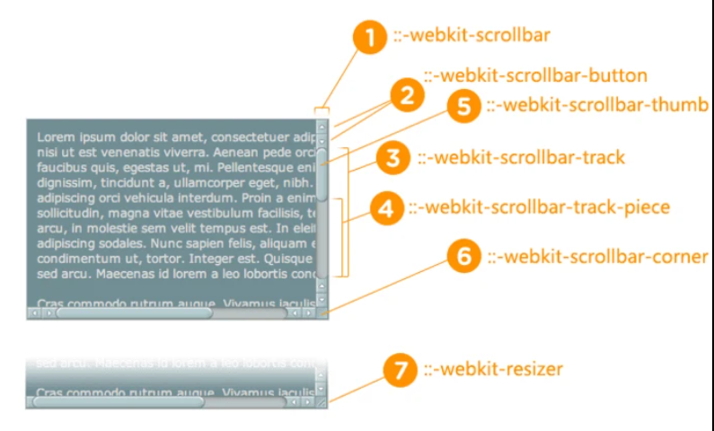

# 用户体验

## 鼠标样式

> 常规的cursor属性

1. `cursor:auto`:默认值.表示光标形状根据内容类别浏览器自动进行处理
2. `cursor:default`.系统默认光标形状,不是默认值
3. `cursor:none`.让光标元素隐藏不见,一般是全屏视频的时候,不希望光标出现

> 链接和状态

1. `cursor:pointer`.一只伸出食指的手
2. `cursor:help`.帮助,用于帮助链接或者包含信息的?图标上
3. `cursor:progress`.加载中.更适合loading处理,比如收发一个信息的时候.
4. `cursor:wait`.加载中的圈圈.

>选择

1. `cursor:text`.这样的标志:`I`.表示文本可以被选中
2. `cursor:vertial-text`.标志:倒过来的`I`表示文字可以被垂直选中
3. `cursor:crosshair`:十字光标,用于像素级的框选或者点选场合
4. `cursor:cell`.和`distable:table-cell`是同一个东西.表示单元格是可以框选的

>拖拽

1. `cursor:move`.光标变成`cursor:move`往往就意味着当前元素是可以移动的
2. `cursor:copy`:光标变成cursor:copy,往往就意味着当前元素是可以被复制的
3. `cursor:alias`:光标变成cursor:alias,往往就意味着当前元素是可以创建别名或者快捷方式的
4. `cursor:no-drop`:光标变成cursor:no-drop,往往就意味着当前元素放开到当前位置是不允许的
5. `cursor:not-allowed`:光标变成`cursor:not-allowed`,往往就意味着当前行为是禁止的

>拉伸

* `cursor:col-resize`:它适用于移动垂直线条,如垂直参考线如果要通过移动改变左右分栏的宽度,建议使用`cursor:ew-resize`
* `cursor:row-resize`:光标形状类似.它适用于移动水平线条,如水平参考线.如果要通过移动改变上下分栏的高度,建议使使用`cursor:ns-resize`

* 单向拉伸:总共 8 个方位 8 个不同的关键字属性值
  * `cursor:n-resize`.理应是一个朝上的单箭头
  * `cursor:e-resize`.理应是一个朝右的单箭头
  * `cursor:s-resize`.理应是一个朝下的单箭头
  * `cursor:w-resize`.理应是一个朝左的单箭头
  * `cursor:ne-resize`.理应是一个朝右上角的单箭头
  * `cursor:nw-resize`.理应是一个朝左上角的单箭头
  * `cursor:se-resize`.理应是一个朝右下角的单箭头
  * `cursor:sw-resize`.理应是一个朝左下角的单箭头
* 双向拉伸:总共 4 个对立方位组合.名称和近似形状如下.
  * cursor:ew-resize
  * cursor:ns-resize
  * cursor:nesw-resize
  * cursor:nwse-resize

>缩放

* `cursor:zoom-in`:光标形似放大镜
* `cursor:zoom-out`:光标形似缩小镜

> 抓取

* `cursor:grab`:光标是一个五指张开的手
* `cursor:grabbing`:光标是一个五指收起的手

>自定义光标

* 对于Chrome等浏览器,可以直接使用PNG图片作为光标

```css
.cur-none { 
 cursor: url(transparent.png); 
} 
```

## 点击行为

### pointer-events

>pointer-events属性施一公非常实用的css新特性

* `pointer-events:none`的介绍
  1. 设置none并不能阻止键盘行为,按钮元素依然可以通过Tab键被focus聚焦,并且可以在focus聚焦状态下通过Enter间触发点击事件,也即是说设置`pointer-events:none`实现的是部分禁用
  2. 设置none会影响无障碍访问,如果设置按钮在被禁用的时候,可以通过title属性或者其他提示的组件在鼠标指针悬停显示禁用的原因,如果设置了`pointer-events:none`,则无法显示
* 继承性:通过祖先元素设置了`pointer-events`,那么子元素也会有相同的效果.不过子元素同样也可以覆盖祖先元素pointer-events的属性值

#### 其他属性

```css
pointer-events: auto | none | visiblePainted | visibleFill | visibleStroke | visible | painted | fill | stroke | all;
```

* `visiblePainted`:SVG元素响应鼠标事件首先需要visibility的计算值是visible,同时鼠标指针移动到填充区域的时候fill不是none,移动到描边区域的时候stroke不是none(肉眼可见的有描边或有填充的地方都可以响应鼠标事件)
* `visibleFill`:SVG元素响应鼠标事件首先需要visibility的计算值是visible,同时鼠标指针经过的区域需要是填充区域,无论有没有填充颜色或图案都可以响应,但是同时会忽略描边区域(鼠标指针经过SVG元素的描边区域不会有任何鼠标响应事件发生)
* `visibleStroke`:和visibleFill关键字属性值的区别就是描边和填充的地位调换.对于属性值visibleStroke,鼠标指针经过描边区域可以影响鼠标事件,但是经过填充区域不会有任何响应
* `visible`:SVG元素只需要visibility的计算值是visible就能影响点击事件,不管fill属性值是不是none,也不管stroke属性值是不是none.(只要元素显示,任意描边或填充区域都可以响应鼠标事件)
* `painted`:和visiblePainted关键字属性值的区别在于,对于painted属性值,就算元素的visibility计算值是hidden,也是可以影响鼠标事件的,例如点击或者悬停效果等
* `fill`:类似的,fill关键字并不需要SVG元素的visibility计算值是visible,就算visibility计算值是hidden,鼠标一样可以点击填充区域
* `stroke`:SVG元素的visibility计算值就算是hidden,描边区域也能响应鼠标事件,填充区域则不能响应鼠标事件
* `all`:和painted关键字的区别在于,painted关键字需要fill或者stroke的属性值不是none,而all关键字没有这个限制

## 滚动行为

### scroll-behavior

>scroll-behavior是一个交互效果渐进增强的css属性

```css
scroll-behavior: auto;
scroll-behavior: smooth;
```

* 其中auto是初始值,不常用,一般是在滚动容器元素上使用`scroll-behavior:smooth`,让元素的滚动变得平滑
* 如果想要在切换的时候要有平滑的动画效果很简单,只要在容器元素的css代码中新增一句`scroll-behavior:smooth`

   ```css
   .box{
     scroll-behavior:smooth;
     overflow: hidden;
   }
   ```

>更好的做法是:<span style="color:red">凡是需要滚动的地方都加一句`scroll-behavior:smooth`</span>

* 例如桌面端中的网页默认滚动代码在\<html>标签上,移动端中的网页默认滚动代码大多数在\<body>标签上
  * 此时经常使用的锚点定位功能就有平滑定位功能,而不是瞬间跳转的效果

```css
html,body{ scroll-behavior: smooth; }
```

>使用`Element.scrollIntoView()`

* Element 接口的`scrollIntoView()`方法会滚动元素的父容器,使被调用`scrollIntoView()`的元素对用户可见

```js
element.scrollIntoView(); // 等同于 element.scrollIntoView(true)
element.scrollIntoView(alignToTop?); // Boolean 型参数
element.scrollIntoView(scrollIntoViewOptions?); // Object 型参数
```

* `alignToTop`?:布尔值
  * `true`:元素的顶端将和其所在滚动区的可视区域的顶端对齐.默认为`scrollIntoViewOptions: {block: "start", inline: "nearest"}`
  * `false`:元素的底端将和其所在滚动区的可视区域的底端对齐.默认为:`scrollIntoViewOptions: {block: "end", inline: "nearest"}`
* `scrollIntoViewOptions`?:一个包含下列属性的对象
  * `behavior`?:定义动画过渡效果,`auto`或`smooth`之一.默认为`auto`
  * `block`?:定义垂直方向的对齐,`start`,`center`,`end`,`nearest`之一.默认为`start`
  * `inline`?:定义水平方向的对齐,`start`,`center`,`end`或`nearest`之一.默认为`nearest`

### overscroll-behavior

>使用overscroll-behavior属性可以实现当滚动嵌套时终止滚动

* 默认情况下,局部滚动的滚动条滚动到底部边缘在继续滚动的时候,外部容器滚动条会继续跟着滚动
  * 但是,有时候我们希望局部滚动条滚到底部之后,滚动行为就停止.
  * 例如下拉列表中的滚动条滚动到底部的时候,如果外部容器的滚动条还继续滚动

1. `overscroll-behavior`属性可以设置DOM元素滚动到边缘的行为
   * 语法:`overscroll-behavior: [ contain | none | auto ]{1,2}`
   * 它支持1~2个值,分别表示x方向和y方向
     * `auto`:**默认值**,表现为默认看到的滚动行为,即滚动条滚动到边缘后继续滚动到外部的可滚动容器
     * `contain`:默认的滚动溢出只会表现在当前元素的内部,不会队响铃的滚动区域进行滚动
     * `none`:响铃的滚动区域不会发生滚动,并且会阻止默认的滚动溢出行为
2. 其他相关的语法
   * overscroll-behavior和overflow类型,也支持分解为`overscroll-behavior-x`和`overscroll-behavior-y`,分别表示水平滚动和垂直滚动的边界行为

### overflow-anchor

>了解滚动锚定

* 当视口上面的内容突然出现的时候,浏览器会自动改变滚动高度,让视口区域内容固定,就像滚动效果被锚定一样
* 有时候滚动锚定不是正确的选择:例如用户使用按钮加载一些数据的时候,这时候使用滚动锚定就会让视口跟着按钮走,而不是视口加载的数据推开按钮

* 语法:`overflow-anchor: auto | none`
  * `overflow-anchor:auto`是**初始声明**,表示浏览器自己决定滚动的锚定行为,通常是执行滚动锚定
  * `overflow-anchor:none`表示禁止锚定的行为

### CSS Scroll Snap

> CSS SCroll Snap可以让网页容器滚动停止的时候,自动平滑定位到指定元素的指定位置,包含以`scroll-`和`scroll-snap-`开头的诸多css属性

* 大概的样式就是你水平滚动页面上的土拍你区域就会发现,当滚动行为停止的时候,图片就会自动调整位置,使自己滚动视口的居中位置显示
  * 容器使用`scroll-snap-type`属性,子元素使用`scroll-snap-align`属性,可以让页面滚动提留在你希望用户关注的重点区域
  * 在IOS中,safari浏览器中需要同时设置`-webkit-overflow-scrolling:touch`才有效

```html
<style>
  .scroll-x { 
    max-width: 414px; height: 420px; 
    scroll-snap-type: x mandatory; 
    white-space: nowrap; 
    overflow: auto;
} 
.scroll-x img { scroll-snap-align: center;}
</style>
<div class="scroll-x"> 
   
   
   
  
</div> 
```

| 作用在滚动容器上            | 作用在滚动定位子元素上     |
| --------------------------- | -------------------------- |
| scroll-snap-type            | scroll-snap-align          |
| scroll-snap-stop            | scroll-margin              |
| scroll-padding              | scroll-margin-top          |
| scroll-padding-top          | scroll-margin-right        |
| scroll-padding-right        | scroll-margin-bottom       |
| scroll-padding-bottom       | scroll-margin-left         |
| scroll-padding-left         | scroll-margin-inline       |
| scroll-padding-inline       | scroll-margin-inline-start |
| scroll-padding-inline-start | scroll-margin-inline-end   |
| scroll-padding-inline-end   | scroll-margin-block        |
| scroll-padding-block        | scroll-margin-block-start  |
| scroll-padding-block-start  | scroll-margin-block-end    |
| scroll-padding-block-end    |

* 合并一下这些css属性
  1. 作用在滚动容器上:`scroll-snap-type`,`scroll-snap-stop`,`scroll-padding/scroll-padding-*`
  2. 作用在滚动子元素上:`scroll-snap-align`,`scroll-margin/scroll-margin-*`
* 作用在容器上的`scroll-padding`相关属性和作用在子元素上的`scroll-margin`相关属性都是用来调整定位点的位置的,于定位效果没有必然关系,且语法上与padding和margin属性一致

>[scroll-snap-type](https://demo.cssworld.cn/new/13/1-5.php)属性用于确定定位方式是水平滚动定位还是垂直滚动定位

* `none`:**默认值**.表示滚动时忽略捕捉点,就是平时使用的滚动定位
* `x`:捕捉水平定位点
* `y`:捕捉垂直定位点
* `block`:捕捉和块状元素排列一个滚动方向的定位点,默认文档流下指的是垂直轴
* `inline`:捕捉和内联元素排列一个滚动方向的定位点,默认文档流下指的是水平轴
* `both`:横轴,纵轴都捕捉
* `mandatory`:**表示强制,为可选参数**.强制定位,也就是如果存在有效的定位位置,则滚动容器必须在滚动结束时进行定位
* `proximity`:**表示大约,为可选参数**.白女士可能会定位,让浏览器自己选择

* mandatory和proximity效果类似,只有当滚动容器的窗口尺寸比子元素的尺寸还要小的时候,才会有差异
  * 为了让滚动容器在尺寸不足的时候,不会出现部分区域或者部分元素永远不可见的情况
  * 例如使用mandatory定位的图片靠近上下便源的区域时永远看不到的
  * 但是使用`proximity`的图片不是这样的
* <span>在绝大多数情况下,可以直接使用`mandatory`进行强制定位</span>.如果容器尺寸较小,有部分重要内容必须要显示,则使用`proximity`强制定位

>scroll-snap-stop

* scroll-snap-stop属性表示是否允许滚动容器忽略捕获位置
  1. `normal`:默认值,可以忽略捕获位置
  2. `always`:不能忽略捕获位置,且定位到第一个捕获元素的位置

* 该属性可以保证我们每次只滚动一屏或者一个指定元素,而不会一下子滚动多屏或者多个元素

> scroll-snap-align

* 该属性作用在滚动容器的子元素上,表示捕获点是上边缘,下边缘或者中间位置
   1. `none`:**默认值**.不定义位置
   2. `start`:起始位置对齐,如垂直滚动,子元素和容器同上边缘对齐
   3. `end`:结束位置对齐,如垂直滚动,子元素和容器同上边缘对齐
   4. `center`:居中对齐,子元素中心和滚动容器中心一致

* `scroll-snap-align`:支持同时使用两个属性值

```css
scroll-snap-stop: start end;
```

* 虽然CSS Scroll Snap包括的css属性很多,但是在实际开发中只需要编写下面这样的css

```css
scroll-snap-type: x/y;
scroll-snap-align: start/end/center;
```

### 滚动条样式

> 用于修改滚动条的css样式

1. `scrollbar-width`:该属性用来设置滚动条的宽度,仅支持关键字属性值,并不支持长度值
   * 语法`scrollbar-width: auto | thin | none;`
   * `auto`:采用系统默认的滚动条样式
   * `thin`:如果系统有窄的滚动条选项就使用这个窄的滚动条,如果没有就使用比滚动条宽度窄一点的宽度
   * `none`:滚动条不显示,但是页面还是可以正常滚动
2. `scrollbar-color`:用来设置滚动条的颜色
   * 语法:`scrollbar-color: auto | dark | light | <color>{2}`
   * `auto`:采用系统默认的滚动条颜色,具体的颜色有操作系统使用的主题决定
   * `dark`:深色滚动条,可以是系统提供的滚动条的深色变体,也可以使带有深色的自定义滚动条
   * `light`:浅色滚动条.可以是系统提供的滚动条的浅色变体,也可以使带有钱色的自定义滚动条
   * `<color>`:专门指定滚动条的颜色,第一个颜色值表示点击滑块的颜色,对应webkit内核浏览器私有的`::-webkit-scrollbar-thumb`伪元素,第二个颜色是滚动滚到的颜色,对应webkit内核浏览器私有的`::-webkit-scrollbar-track`伪元素

* 目前只需要关心`scrollbar-color:<color> <color>`

> 更改滚动条的伪元素样式



* `::-webkit-scrollbar`:指滚动条整体部分,它的属性有`width`,`height`,`background`等
* `::-webkit-scrollbar-button`: 指滚动条两边的按钮.当不需要时可以用`display:none`将其隐藏
* `::-webkit-scrollbar-track`:指外层轨道部分,当不需要时可以用`display:none`将其隐藏,也可以添加你想要的颜色
* `::-webkit-scrollbar-track-piece`:指内层轨道部分,即滚动条中间的部分
* `::-webkit-scrollbar-thumb`:指滚动条里面可以拖动的部分,也就是滑块
* `::-webkit-scrollbar-corner`:指边角部分
* `::-webkit-resizer`:他用来定义右下角滑块的样式

* 任何对象都可以设置:**边框**、**阴影**、**背景图片**等等,创建的滚动条任然会按照操作系统本身的设置来完成其交互的行为.下面的伪类可以应用到上面的伪元素中
  * `:horizontal`适用于任何水平方向上的滚动条
  * `:vertical`:适用于任何垂直方向的滚动条
  * `:decrement`:适用于按钮和轨道碎片.表示递减的按钮或轨道碎片,例如可以使区域向上或者向右移动的区域和按钮
  * `:increment`:适用于按钮和轨道碎片.表示递增的按钮或轨道碎片,例如可以使区域向下或者向左移动的区域和按钮
  * `:start`:适用于按钮和轨道碎片.表示对象(按钮轨道碎片)是否放在滑块的前面
  * `:end`:适用于按钮和轨道碎片.表示对象(按钮轨道碎片)是否放在滑块的后面
  * `:double-button`:适用于按钮和轨道碎片.判断轨道结束的位置是否是一对按钮.也就是轨道碎片紧挨着一对在一起的按钮.
  * `:single-button`:适用于按钮和轨道碎片.判断轨道结束的位置是否是一个按钮.也就是轨道碎片紧挨着一个单独的按钮.
  * `:no-button`:表示轨道结束的位置没有按钮.
  * `:corner-present`:表示滚动条的角落是否存在.
  * `:window-inactive`:适用于所有滚动条,表示包含滚动条的区域,焦点不在该窗口的时候.

## 拉伸行为

>拉伸行为的背后是resize属性的作用

* 语法:`resize:none | both | horizontal | vertial | block | inline`
  * `none`:初始值,表示没有拉伸效果,常用来重置\<textarea>元 素内置的拉伸行为
  * `both`:既可以水平方向拉伸,也可以垂直方向拉伸
  * `horizontal`:仅可以水平方向拉伸,此时鼠标的指针也会变成水平方向的拉伸样式
  * `vertical`:仅可以垂直方向拉伸,此时鼠标的指针也会变成垂直方向的拉伸样式
  * `block`:后期新增的属性值,目前现代浏览器都提供支持.其表示沿着块级元素的排列方向拉伸,默认是垂直方向,也可能是水平方向,这取决于writing-mode的值

1. resize作用的条件
   * 不支持内联元素
   * 如果是块级元素,需要使用overflow属性的计算值不是visible
2. resize生效的原理
   * 设置了resize属性的元素通过拉伸改变元素的尺寸是通过设置元素的width属性值和height属性值实现的

* 如果希望元素的拉伸的尺寸不是无限的,可以通过设置`min-widht`,`min-height`,`max-widht`和`max-height`属性进行限制

```css
div { 
  min-width: 200px; 
  max-width: 600px; 
  overflow: hidden; 
  resize: both;
}
```

> resize属性拖拽条的样式可以使用`::-webkit-resizer`伪元素进行自定义

```css
::-webkit-scrollbar { 
  background-image: url(resize.png);
}
```

## 输入行为

>caret-color属性可以改变输入框插入光标的颜色,同时又不改变输入框里内容的颜色

```css
input { 
  color: #333; caret-color: red;
}
```

* 只有光标颜色变成红色,文字颜色变成黑色

## 选择行为

> `user-select`:通常设置`user-select:none`禁止图文被选中

```css
body { 
  -webkit-user-select: none; 
  user-select: none;
}
```

* 语法:`user-select: auto | text | none | contain | all`
  * `cntain`表示被选中,无任何浏览器支持
  * `all`表示元素的内容需要整体选择,而不是所有类型的内容都可以选择

* 无论将user-select属性值设为什么,::before和::after伪元素生成的内容都表现为none,也就是生成的内容永远无法被选中
  * 如果将父元素的user-select属性值设置为all,则当前元素的user-select属性值表现也是all
  * 如果将父元素的user-select属性值设置为none,则当前元素的user-select属性值表现也是none

>使用`::selection`改变文字被选中后的颜色

* 使用::selection伪元素可以改变文字被选中后的颜色和背景色

```html
<style>
.maroon::selection { 
  background: maroon; color: #fff;
}
</style>
<p class="maroon">圣体健康,给大佬们请安</p> 
```

* 使用`::selection`伪元素不仅可以改变被选中文字的颜色和背景色,理论上还能改变文字阴影颜色、下划线颜色和轮廓颜色等
  * color
  * background-color
  * cursor
  * caret-color
  * outline和非缩写CSS属性
  * text-decoration和相关CSS属性
  * text-emphasis-color
  * text-shadow
  * stroke-color、fill-color和stroke-width属性
* 并且`::selection`伪元素不仅可以改变被选中的文字样式,被选中的图像样式同样可以修改

## 性能增强

> `will-change`:增强页面渲染性能.现代浏览器3D变换会启用GPU加速

* 当我们点击等触发大面积绘制的时候,浏览器往往是没有准备的被动使用GPU计算于重绘,而设置`will-change`会提前告知GPU这种行为

```css
/* 语法 */
will-change: auto; 
will-change: scroll-position | contents | <custom-ident>
```

* 如果发现滚动动画卡顿,则可以试试`scroll-position`.如果是内容变化,则可以试试contents.如果是其他CSS属性动画性能不佳,掉帧明显,则可以试试\<custom-ident>类型的属性值
* \<custom>类型只能是css自带的属性,不能是自定义的
* transform和opacity动画性能是最好的
* 不过很少使用`will-change`去提高动画性能,通常用于创建层叠上下文.例如元素设置`will-change:transform`会有和transform属性一样的行为
  1. 创建层叠上下文,影响元素的层级
  2. 会影响混合模式的计算
  3. 设置overflow:hidden会隐藏内部溢出的绝对定位元素

### contain属性

* contain属性可以让局部的DOM树成为一个独立的部分,和页面其他的DOM树完全隔离,这样在这部分内容发生变化的时候,重绘于重计算只会在这个局部DOM树结构内部发生

#### 理解四种限制类型
  
* Size Containment
* Layout Containment
* Style Containment
* Paint Containment

> Size Containment:这里只的是内部元素的变化不会影响当前元素尺寸的变化,而不是`max-height/min-width`这种尺寸变化

```html

```

* 这张图片就有一个尺寸,这个尺寸在默认状态下是1.jpg这张图片的原始尺寸.如果我们将1.jpg修改为另外一个不同尺寸的2.jpg,则\元素的尺寸就会跟着变化
* 具体实现的**尺寸限制**
  1. 让浏览器直接无视元素里面的内容就可以了,也就是假设元素里面的元素不存在;如果是替换元素,就认为替换内容不存在
  2. 尺寸限制状态下的元素的尺寸都是0*0,如果没有设置边框等,元素默认不可见
  3. 实际开发中,应用`Size Containment`元素一定是需要设置具体的width和height
* 不是所有的元素都支持Size Containment,不支持的元素包括`display:contents`和`display:none`的元素
* 使用场景:使用js根据包含快元素的尺寸设置内部元素尺寸,可以有效的避免某种循环
  * inline-block水平的元素的尺寸是根据元素里面的内容决定的,现在希望元素里面内容的尺寸永远比inline-block的尺寸小1px.
  * 按照字面上的需求,我们可以先使JavaScript获取inline-block水平的尺寸,再去修改元素里面子元素的尺寸.但是,这种做法会带来一个问题,那就是inline-block的尺寸是根据元素里面子元素的尺寸变化的,如果子元素尺寸变小了,岂不是inline-block元素的尺寸也要变小,这又会导致子元素尺寸再次变小

>Layout Containment:可以想象元素的骨架,框架或者渲染盒子进行封闭,形成的结界

* 会形成一个全新的包含块,无论是绝对定位元素还是固定定位元素的left和top偏移都会相对这个包含块计算
* 会创建一个新的层叠上下文,除了可以改变元素重叠时的层级表现,还可以限制混合模式等
* 创建一个新的格式化上下文

>Style Containment:指css计数器和其他相关内容的生成的限制

* CSS计数器属性`counter-increment`和`counter-set`是受到整个DOM树中的计数器影响的
  * 例如:父元素执行依次counter-increment,子元素又执行一次counter-increment.最终的计数值时父子元素累加值
  * 如果设置Style Containment.则计数的范围就会被限定在元素的子树上
* Style Containment除了限制计数器的作用范围,对其他content内容生成特性同样适用,包括open-quote、close-quote、no-open-quote和no-close-quote

>Paint Containment:与Layout Containment很相似.都会成为绝对定位和固定定位元素的包含快,会创建性的层叠上下文

* 不同之处就是Layout Containment不会渲染任何包含框之外的内容,那排overflow属性值时visible.
* 并且Layout Containment依然会保留溢出内容对布局的影响.(如改变基线对齐)

```html
<style>
p {
   display: inline-block; 
   width: 150px; height: 36px; 
   padding: 10px; 
   background: skyblue;
}
</style>
<button>基线对齐</button> <p>不同之处就是Layout Containment不会渲染任何包含框之外的内容,那排overflow属性值时visible. </p> 
```

#### contain属性值语法

```css
ontain: none; contain: strict; contain: content;
contain: [ size || layout || style || paint ]
```

* Size Containment限制类型对应属性值size,不妨就称为size类型
* Layout Containment限制类型对应属性值layout,不妨就称为layout类型
* Style Containment限制类型对应属性值style,不妨就称为style类型
* Paint Containment限制类型对应属性值paint,不妨就称为paint类型

* strict表示对除style类型以外的类型都进行限制.此属性值等同于`contain: size layout paint`的设置
* content表示对除size和style类型以外的类型都进行限制.此属性值等同于`contain: layout paint`,表现为元素内容渲染,元素外内容不渲染

#### content-visibility

* `content-visibility`属性表示可以让浏览器决定是否渲染视区以为的内沟通,来提高也面的渲染性能

* 当浏览器决定不渲染某个元素里面的内容的时候,元素会开启`Layout Containment`、`Style Containment`和`Paint Containment`,如果元素没有设置具体的高,宽值,则尺寸可能是0
* 随着浏览器页面的滚动,元素进入视区后会再次渲染,此时就会出现内容跳动的情况,这种体验反而糟糕

```css
article{
  content-visibility:auto;
  contain-intrinsic-size: 1000px;
}
```

* `contain-intrinsic-size`可以理解为内容的占位尺寸
* 并且content-visibility并不成熟
