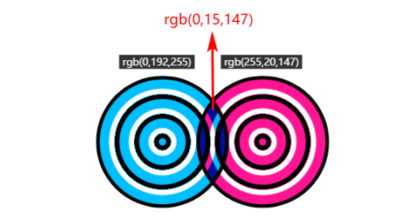
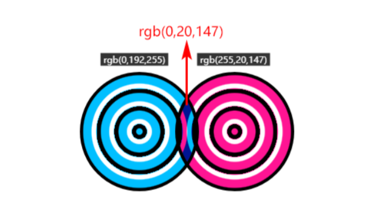
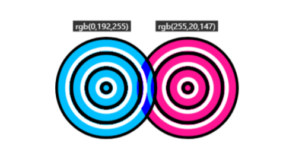
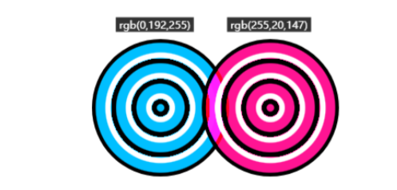
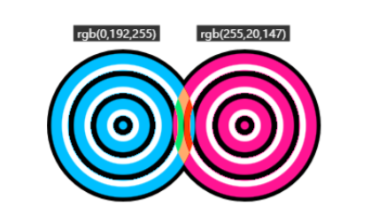
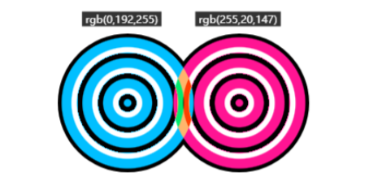
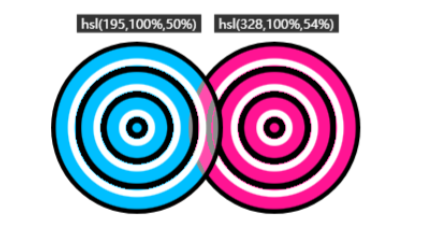

# 视觉效果

## filter

| 滤镜        | 释义     |
| ----------- | -------- |
| blur        | 模糊     |
| brightness  | 亮度     |
| contrast    | 对比度   |
| drop-shadow | 投影     |
| grayscale   | 灰度     |
| hue-rotate  | 色调变化 |
| invert      | 反相     |
| opacity     | 透明度   |
| saturate    | 饱和度   |
| sepia       | 褐色     |

>模糊滤镜函数blur()

* 使用blur()函数可以让元素或者图像产生高斯模糊的效果
  * blur()函数支持任意长度值,但是不支持百分比值

   ```css
   img{ filter:blur(5px); }
   ```

* blur()函数的参数值表示高斯函数的标准偏差值,可以理解为屏幕上互相融合的像素数量.因此blur()参数值越大,图像的模糊效果越明显
  * 使用`backdrop-filter`的blur()属性实现高斯模糊效果,边缘默认不会泛白
  * blur()函数还可以用来实现径向模糊或者局部模糊效国.需要使用`mask-image`

>亮度滤镜函数`brightness()`

* brightness()函数可以用来调节元素的亮度

```css
img{ filter: brightness(2.4); }
```

* brightness()支持数值和百分比.范围是0~无穷大,参数值0或者0%表示纯黑色,参数值是1或者100%表示正常的亮度
  * 0~1或者0~100%的亮度是线性变化的
  * 随着参数逐渐大于1或者大于100%,元素的亮度也会逐渐提升

1. brightness()的参数可以为空,为空默认就是1
2. 深色模式下希望降低图像的亮度就可以使用brightness()函数
3. 使用brightness()函数后在设置足够大的亮度之后可以让图标变成白色

>对比滤镜函数contrast()

* contrast()函数可以用来调节元素的对比度

```css
img{ filter:contrast(2); }
```

* contrast()函数的参数值支持数值和百分比值.范围是**0~无穷大**参数值0或者0%表示无对比度,表示为纯灰色.
  * 纯灰色的色块而不是图像灰度

>投影滤镜函数drop-shadow()

* 使用drop-shadow()函数可以给元素设置符合真实世界阴影规则的投影效果
* 语法:`filter:drop-shadow(x偏移,y偏移,模糊大小,色值)`

   ```css
   img{ filter:drop-shadow(4px 4px 8px blue); }
   ```

  * `drop-shadow()`函数最多支持三个参数.`box-shadow()`属性最多支持4个数值,其中第四个表示扩展

1. drop-shadow()函数不支持扩展,因为真实世界的投影没有所谓的扩展
2. drop-shadow()函数没有内投影的效果,但是box-shadow属性可以使用inset关键字
3. drop-shadow()函数不支持投影叠加,box-shadow属性允许无限叠加

* 使用drop-shadow()函数实现的投影式符合真实世界表现的投影,凡是透明镂空的地方,一定会留下相应的阴影轮廓
* 使用box-shadow()函数式盒阴影,只会在方方正正的盒子的四周留下阴影的效果,无论是镂空还是凸出的图形都不会有阴影效果
* 

>灰度滤镜函数grayscale()

* 使用`grayscale()`函数可以是心啊元素的去色效果,让所有的彩色值都变成灰度

```css
img{ filter:grayscale(0.7); }
```

* grayscale()函数的参数值和百分比值,范围是0~无穷大.
  * 参数值为1或者100%的时候表现为完全灰度,参数值大于100%的时候也表现为王权灰度
  * 在0或者0%是正常图像表现,在0~1或者0%~100%范围区间的灰度是线性变化的

>色调旋转滤镜函数hue-rotate()

* `hue-rotate()`函数可以调整元素的色调,但饱和度和亮度保持不变

```css
img{ filter:hue-rotate(90deg); }
```

* `hue-rotate()`函数的参数值支持角度值,例如90deg或者0.5turn,角度值没有限制,每360°就是一个循环
* 并且hue-rotate()函数不会改变任意灰度色值(包括黑色和白色),因此可以利用函数非常方便的复制出色彩小组件
  * 只需要编写一个主按钮样式,然后使用下面一行css代码

  ```css
  .btn{ filter:hue-rotate(60deg); }
  ```

* 由于所有的filter属性都是支持的滤镜函数都支持animation动画效果,因此使用hue-rotate()函数可以轻松实现元素的色彩无限变化

```css
@keyframes hue{
  from {filter: hue-rotate(0deg);}
  to {filter: hue-rotate(360deg);}
}
```

>反相滤镜函数invert()

* invert()函数可以让元素的来个年度和色调同时反转

```css
img{ filter:invert(75%); }
```

* invert()函数的参数值支持数值和百分比值,范围是**0~无穷大**
  * 参数值为1或者**无穷大**表现为完全反相
  * 当大于1或者大于100%时效果不会进一步变化
  * 0或者0%表示图像的表现正常

* invert()可以和hue-rotate()函数一起使用,实现反转元素亮度的效果

```css
filter: invert(1) hue-rotate(180deg);
```

> 透明度滤镜函数opacity()

* opacity()函数可以改变元素的透明度,效果和opacity属性类似

```css
img{ filter: opacity(0.5); }
```

* opacity()函数支持百分比和数值,范围是**0~无穷大**.
  * 参数值为0或者0%的时候图像表现为完全透明
  * 参数值为1或者100%或者更大的时候,图像均表现正常

>饱和度滤镜函数saturate()

```css
img{ filter:saturate(230%); }
```

* `saturate()`函数的参数值支持百分比值,范围是**0~无穷大**
  * 参数值0或者0%表示毫无饱和度,表现为灰度效果,等同于grayscale(1)
  * 参数值1或者100%表示正常的饱和度,随着参数的值逐渐大于1,元素的饱和度会逐渐提升

>褐色滤镜函数sepia()

* sepia()函数可以让元素的视觉效果向褐色靠拢

```css
img{ filter:sepia(60%); }
```

* `sepia()`函数的参数值和百分比值,范围是**0~无穷大**.
  * 当参数值为1或者100%,或者大于1或者100%,图像均表现为深褐色
  * 当参数值为0或者0%,图像是原始效果

## backdrop-filter

* `backdrop-filter`可以非常轻松的实现毛玻璃效果等美观的滤镜

> backdrop-filter属性和filter属性的区别就是,backdrop-filter属性是让当前元素所在区域后面的内容实现滤镜效果,要想看到滤镜效果,<span style="color:red">当前的元素必须半透明或者完全透明</span>.filter属性是让当前元素自身实现滤镜效果

1. filter属性应用高斯模糊(blur),则该图像的四周会有柔化的问题,但是改用`backdrop-filter`属性则没有此问题
2. backdrop-filter属性生效很简单,只需要有滤镜效果的地方覆盖一个元素,即使没有背景也依然可以生效
   * 如果设置`opacity:0`依然有背景滤镜的效果,如果设置`visibility:hidden`是没有背景滤镜的效果

## 混合模式

1. `background-blend-mode`:用于混合元素背景图案,渐变和颜色
2. `mix-blend-mode`:用于元素与元素之间的混合
3. `isolation`:用于祖先元素,限制`mix-blend-mode`属性设置的混合模式的应用范围

>* 其中mix-blend-mode属性和background-blend-mode属性支持的混合模式类型是一样的,总共有16种混合模式
>* 这些混合模式不仅仅使用于图片,同样还可以适用于视频

| 混合模式类型 | 释义     |
| ------------ | -------- |
| normal       | 正常     |
| multiply     | 正片叠底 |
| screen       | 滤色     |
| overlay      | 叠加     |
| darken       | 变暗     |
| lighten      | 变亮     |
| color-dodge  | 颜色变淡 |
| color-burn   | 颜色加深 |
| hard-light   | 强光     |
| soft-light   | 柔光     |
| difference   | 差值     |
| exclusion    | 排除     |
| hue          | 色调     |
| saturation   | 饱和度   |
| color        | 颜色     |
| luminosity   | 亮度     |

>`mix-blend-mode:multiply`混合效果是正片叠底

* 表现的色值的计算公式是`C = AB/255`
* 例如已知颜色的关键字deepskyblue的RGB色值是rgb(0,192,255),颜色关键字deeppink的RGB的色值是rgb(255,20,147).
  * 则这两种颜色正片叠底混合后的颜色是rgb(0,15,147)
  * R=0*255/255=0
  * G=192*20/255=15
  * B=255*147/255=147
  * 

* 任意颜色和黑色(0),正片叠底后一定是黑色,任意颜色和白色(色值是255)正片叠底后一定是当前颜色
* 由于A和B的色值最大就是255,因此黑和白两色混合时颜色不变之外,和其他颜色混合的正片叠底效果一定会变暗
* 正片叠底可以增强两张图像中暗的部分,其表现就像两张半透明相片叠加在一起放在发光的桌子上

>`mix-blend-mode:screen`:混合效果时滤色

* 计算公式:`C = 255 - (255-A)(255-B)/255`
* screen的效果和`multiply`正好相反,multipy的效果是混合后颜色变暗,而screen是混合后颜色变亮

* 任何颜色和黑色进行滤色混合后,还是呈现原来的颜色
* 任何颜色和白色进行滤色混合后,呈现的任然是白色
* 任何颜色和其他颜色进行滤色混合,颜色会更浅,类似于漂白
* 

* 滤色模式适用于在图像中创建霓虹灯效果
  1. 对一些图像素材添加场景特效,如各种天气或者霓虹灯等
  2. 如果使用PNG图像,效果会很不自然,并且文件非常大,会达到上百kb
  3. 准备黑色的KPG图像(使用滤色混合模式的时候,黑色会被视为透明)

* 对于网页中有烟花的播放效果,可以使用screen混合模式,由于视频默认的背景就是黑色,烟花播放的动画很容易就出现了

>`mix-blend-mode:overlay`:混合效果叠加

* 计算公式
  * `A<=128`:`C = AB/128`
  * `A>128`:`C = 255 - (255-A)(255-B)/255`

* 在底图色值小于或等于128的时候,采用了类似**正片叠底**的算法,而底图色值大于128的时候,采用了类似**滤色**的算法
* 这种混合模式的底图的高光(白色)和阴影(黑色)都会保留
* 其他颜色的饱和度和对比度会有一定程度的提高,混合后的图像看起来会更鲜明
* 

* 例如实现水印效果,使用深色文字,将混合模式设置为叠加,再将文字旋转一定角度

```html
<style>
  .water {
    width: 256px;
    height: 192px;
    position: relative;
  }
  .water::before {
    content: "cssworld.cn";
    position: absolute;
    mix-blend-mode: overlay;
    text-shadow: 10ch 2em, -10ch 2em, 10ch -2em, -10ch -2em, 0 -5em, 0 5em;
    transform: rotate(-30deg);
    left: calc(50% - 5ch);
    top: 90px;
  }
</style>
<div class="water">
  
</div>
```

> `mix-blend-mode:darken`:混合效果是变暗,将两种颜色的RGB通道依次进行比较,选择较小的

* 计算公式:`C = min(A,B)`
* 例如将deepskyblue的RGB色值是rgb(0,192,255),deeppink的RGB的色值是rgb(255,20,147)进行变暗混合
  * R = min(0,255) = 0
  * G = min(192,20) = 20
  * B = min(255,147) = 147
* 

>`mix-blend-mode:lighten`:混合效果是变亮,将两种颜色的RGB通道依次进行比较,选择较大的

* 计算公式:`C = max(A,B)`
* 例如将deepskyblue的RGB色值是rgb(0,192,255),deeppink的RGB的色值是rgb(255,20,147)进行变暗混合
  * R = min(0,255) = 255
  * G = min(192,20) = 192
  * B = min(255,147) = 255
* 

* 可以实现任意PNG图标的变色效果,比mask遮罩属性的变色效果更自由,可以实现任意文字的填充效果,比background-clip声明实现的效果更加丰富,也可以实现任意不规则形状的裁剪效果,比clip-path效果更加灵活

* 例如实现文字渐变效果,只需要将文字设置为黑色,然后再文字上覆盖一层渐变的颜色,是同设置混合模式为`lighten`

```html
<style>
  .gradient-text {
    position: relative;
    font-size: 3rem;
    /* 文字颜色设为黑色 */
    color: black;
    /* 背景颜色设为白色 */
    background: #fff;
  }
  .gradient-text::before {
    content: "";
    position: absolute;
    left: 0;
    right: 0;
    top: 0;
    bottom: 0;
    background: linear-gradient(to right, #9cd6e999, #ad0bea;)
    /* 混合模式设为lighten */
    mix-blend-mode: lighten;
  }
</style>
<div class="gradient-text">CSS新世界</div>
```

* 使用`background-clip:text`声明实现文字的渐变效果实际上是使用背景图填充文字,但是背景图实现的视觉效果是有限的
* 使用混合模式可以是任意元素,并且这些元素可以**随意进行变换或者设置动画效果**

>`mix-blend-mode:color-dodge`:颜色变淡

* 计算公式:`C = A + AB/(255-B)`
* color-dodge颜色扁担混合模式可以用来保护底图的高光
* 适合处理高光下的人物图片,通过照片和特定的颜色混合,可以改变整个照片的色调(暖色或者冷色),并且不会影响人物高光区域的细节
* 

>`mix-blend-mode:color-burn`:颜色加深

* 计算公式:`C = A - (255 - A)(255 - B)/B`
* 在保留地府图层的颜色的基础上,颜色更深了,整体效果就像混合区域的对比度增强了
* `color-burn`颜色加深混合模式可以用来保护底图的阴影,适合处理**幽深密境**一类的照片(更加幽深)
* 

>`mix-blend-mode:hard-light`:混合效果是强光,表现为图像亮的地方更亮,俺的地方更暗

* 计算公式
  * `B<=128`:`C = AB/128`
  * `B>128`:`C = 255 - (255-A)(255-B)/255`

* hard-light和overlay的区别在于,`hard-light`根据上层元素的色值判断是使用正片叠底还是滤色模式,overlay则根据下层元素的色值进行判断.
  * 当上层元素的色值大于128,运行滤色算法,**底色变亮**,有助于增强图像的高光
  * 当上层元素小于或者等于128的时候,运行正片叠底的算法,底片变暗,可增强图像的暗部
* 

>`mix-blend-mode:soft-light`:混合效果是柔光

* 类似于官员四处弥漫,类似于`hard-light`,表现没有`hard-light`那么强烈
  * 例如纯黑或者纯白的上层元素和底层元素混合后的效果仅仅是元素轻微变暗或者变亮,而不是纯黑或者纯白

* 计算公式:
  * `B<=128`:C = AB/128 + (A/255)<sup>2</sup>(255 - 2*B)
  * `B>128`:C = AB/128 + (A/255)<sup>1/2</sup>(2*B - 255)

* 
* 对于一些自然景色的土拍你,柔光模式的着色效果更加自然

>`mix-blend-mode:difference`:混合效果是差值,最终颜色的色值就是较浅颜色的色值减去较深颜色的色值

* 计算公式:`C = | A - B |`
* 如果上层元素是白色,则最终混合的颜色是底层元素的反色.
* 利用这一特性实现文字在不同颜色的效果
* 

>`mix-blend-mode:exclusion`:混合效果是排除,与difference类似,区别在于exclusion的对比度要更低

* 计算公式:`C = A + B - AB/128`
* 
* 咋一看没有什么区别,因为这两种图片的饱和度很高,看不出什么细微差别
* 当图像饱和度越高`exclusion`和`difference`的差异越小;图像饱和度越低,exclusion和difference差异越大
* 对于白色和黑色这两个元素,使用`exclusion`和`difference`进行混合的效果是一样的,白色会发生反色,黑色不会

### 颜色系混合模式

* 所有的颜色系混合模式(色调,饱和度,颜色和亮度)都不能使用黑色进行混合,因为这样会挖掉底层元素的颜色信息,最终导致混合的颜色是灰色

>`mix-blend-mode:hue`:色调混合,作用是颜色混合,使用底层元素的亮度和饱和度,以及上层元素的色调

* 计算公式:HcScLc = H<sub>B</sub>S<sub>A</sub>L<sub>A</sub>
* 
* 例如:天空蓝`hsl(195,100%,50%)`和纯黑色`hsl(0,0%,0%))`,进行色调混合,最后的色值因该是红色`hsl(0,100%,50%)`,最终的效果却是灰色
* 将照片和渐变色进行色调混合,可以让照片呈现出丰富多彩的色调效果

>`mix-blend-mode:saturation`:饱和度混合,混合后的颜色保留底图的亮度和色调,并使用顶图的饱和度

* 计算公式:HcScLc = H<sub>A</sub>S<sub>B</sub>L<sub>A</sub>
* 

>`mix-blend-mode:color`:表示颜色混合,混合后的颜色保留底图的亮度,并使用顶图的色调和饱和度

* 计算公式:HcScLc = H<sub>B</sub>S<sub>B</sub>L<sub>A</sub>
* 
* 颜色的混合模式可以通过css渐变让照片的色调变得丰富起来

> `mix-blend-mode:luminosity`:表示亮度混合,混合后的颜色保留底图的色调和饱和度,并使用顶图的亮度,效果和color模式相反

* 计算公式:HcScLc = H<sub>A</sub>S<sub>A</sub>L<sub>B</sub>
* 
* 亮度混合模式不适用色彩丰富的图像作为底图,因为图像汇总的各种颜色的亮度是不一样的
* 如果替换成有规律的亮度值,会很奇怪
* 只有当上层的元素是复杂的图像的时候,适合使用混合模式,这和color模式正好相反

### background-blend-mode

>background-blend-mode可以在各个背景图像之间使用混合模式

* background-blend-mode属性的使用频率要低于`mox-blend-mode`
   1. 真实世界的照片很少作为`background-image`背景图像呈现(不利于无障碍),混合模式的初衷就是处理这类照片
   2. `background-blend-mode`属性的作用机制不像`mix-blend-mode`属性那么单纯,很难驾驭
* 使用`background-blend-mode`常见的是丰富css背景纹理

#### background-blend-mode使用的细节

1. `background-blend-mode`属性本身就带有隔离特性,也就是说一个元素应用background-blend-mode背景混合模式,最终的效果只会受当前元素的背景图像和颜色影响,不会受到视觉上处于当前区域的其他任意元素的影响
2. 应用background-blend-mode元素之后,不仅各种图像之间要进行混合,各张图像还要和背景色进行混合

> 背景顺序影响混合效果

* 混合效果和background属性中的背景图像的顺序密切相关.在CSS多背景中,语法越靠后的背景图像的层级越低,这也是background-color要写在最后的原因
* 最终的背景图像的顺序是相反的

```html
<style>
    .ball {
    width: 200px;
    height: 200px;
    border-radius: 50%;
    background: linear-gradient(deeppink, deeppink), linear-gradient(deepskyblue, deepskyblue);
    /* 应用叠加混合模式 */
    background-blend-mode: overlay;
  }
  .ball2 {
    width: 200px;
    height: 200px;
    border-radius: 50%;
    background: linear-gradient(deepskyblue, deepskyblue), linear-gradient(deeppink, deeppink);
    /* 应用叠加混合模式 */
    background-blend-mode: overlay;
  }
</style>
<div class="ball"></div>
<div class="ball2"></div>
```

>混合效果是多个混合属性同时作用的结果

* `background-blend-mode`属性可以设置多个混合模式的值,分别对应不同的背景图像,这一点和只支持一个混合模式值的`mix-blend-mode`属性不同

```css
.ball { 
  background: linear-gradient(deeppink, deeppink), linear-gradient(deepskyblue, deepskyblue); 
  background-blend-mode: overlay;
  /* 实际上是 */
  /* background-blend-mode: overlay overlay; */
}
```

* 实际上每一张图像都有一个自己的混合模式值,这和`mix-blend-mode`属性不一样
  * `mix-blend-mode`属性使用的场景:我们只会把模式设置在顶层元素上,而不会给每一层元素都设置.
  * `background-blend-mode`属性的渲染表现是给每一个背景图像设置混合模式
  * 如果是多个混合模式,则会按顺序增减混合模式的属性,达到一一对应

>`background-blend-mode`与属性的补全规则

* 当background-blend-mode的属性值的数量和backgroundimage的属性值的数量不匹配的时候
  1. 如果background-blend-mode的属性值的数量大于background-image的属性值的数量,则多出来的混合模式会被忽略

     ```css
     .example { 
       background: linear-gradient(deepskyblue, deeppink), white; 
       background-blend-mode: lighten, darken;
       /* 等同于 */
       /* background-blend-mode: lighten; */
     }
     ```
  
  2. 如果background-blend-mode的属性值的数量少于`background-image`属性值的数量,则会重复完整的`background-blend-mode`属性值进行补全

     ```css
     .example { 
       background: linear-gradient(deepskyblue, deeppink),
        linear-gradient(deepskyblue, deeppink), 
        linear-gradient(deepskyblue, deeppink), white; 
       background-blend-mode: lighten, darken;
       /* 等同于 */
       background-blend-mode: lighten, darken, lighten;
     }
     ```

## isolation:isolate声明隔离混合模式

>`isolation:isolate`声明的作用很单纯,就是用来隔离混合模式,限制混合模式的作用范围

* isolation属性除了支持全局关键字,还支持auto和isolate 这两个关键字属性值
  * `auto`:是**默认值**,表示混合模式隔离与否根据具体情况而定
  * `isolate`:表示对混合模式进行隔离

```html
<style>
  .box { 
    background: linear-gradient(deepskyblue, deeppink);
  } 
  .inner { 
    background: url(7.jpg);
  }
.mode {mix-blend-mode: overlay;}
</style>
<div class="box"> 
  <div class="inner"> 
    
  </div>
</div> 
```

* 此时不仅两种图片发生了混合,还和渐变背景发生了混合
  * `.inner`这层\<div>元素增加`isolation:isolate`这段css声明进行隔离,形成一个混合模式作用域,作用域意外的元素不会出现混合效果

```css
.inner{
  isolation: isolate;
}
```

> isolation:isolate原来

* isolation:isolate本质上就是创建了一个新的层叠上下文.
  * 也就是说所有可以创建层叠上下文的元素都可以隔离混合模式

* `position:relative`或`position:absolute`定位元素的**z-index值不为auto**
* `position:fixed`固定定位元素
* `flex`子项的z-index值不为auto
* 元素的`opacity`属性值不是1
* 元素的`clip-path`属性值不是none
* 元素的`transform`属性值不是none
* 元素的`mix-blend-mode`属性值不是normal
* 元素的`filter`属性值不是none
* 元素的`contain`属性值不是none
* `will-change`指定的属性值为opacity,clip-path,transform,mix-blend-mode,filter和contain中的任意一个
* 元素的`-webkit-overflow-scrolling`设为touch
